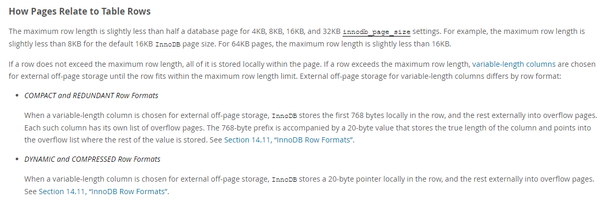
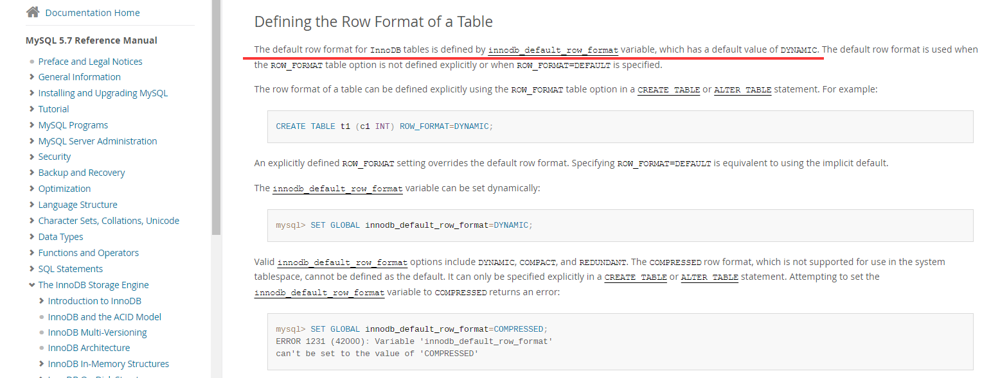

# 文章信息

**标题**

1. MySQL表大小计算方法 
2. 🔥我说MySQL每张表最好不超过2000万条数据，面试官让我回去等通知？

**摘要**

1. 一般来说，MySQL每张表最好不要超过2000万条数据，否则就会导致性能下降。实际情况下，每张表由于自身的字段不同、字段所占用的空间不同等原因，它们在最佳性能下可以存放的数据量也就不同。
2. 面试官：麻烦你好好看看这篇文章，再告诉我，每张表到底能存多少数据？
   实际情况下，每张表由于自身的字段不同、字段所占用的空间不同等原因，它们在最佳性能下可以存放的数据量也就不同。

以下为正文

---


# 事情是这样的

下面是我朋友的面试记录：

> 面试官：讲一下你实习做了什么。
>
> 朋友：我在实习期间做了一个存储用户操作记录的功能，主要是从MQ获取上游服务发送过来的用户操作信息，然后把这些信息存到MySQL里面，提供给数仓的同事使用。由于数据量比较大，每天大概有四五千多万条，所以我还给它做了分表的操作。每天定时生成3张表，然后将数据取模分别存到这三张表里，防止表内数据过多导致查询速度降低。

这表述，好像没什么问题是吧，别急，接着看：

> 面试官：那你为什么要分三张表呢，两张表不行吗？四张表不行吗？
>
> 朋友：因为MySQL每张表最好不超过2000万条数据，否则会导致查询速度降低，影响性能。我们每天的数据大概是在五千万条左右，所以分成三张表比较稳妥。
>
> 面试官：还有吗？
>
> 朋友： 没有了……~~你干嘛，哎呦~~~ 
>
> 面试官：那你先回去等通知吧。

🤣🤣🤣讲完了，看出什么了吗，你们觉得我这位朋友回答的有什么问题吗？

# 前言

一般来说，MySQL每张表最好不要超过2000万条数据，否则就会导致性能下降。阿里的Java开发手册上也提出：单表行数超过 500 万行或者单表容量超过 2GB，**才推荐**进行分库分表。

但实际上，这个2000万或者500万都只是一个大概的数字，并不适用于所有场景，如果盲目的以为表数据只要不超过2000万条就没问题了，很可能会导致系统的性能大幅下降。

实际情况下，每张表由于自身的字段不同、字段所占用的空间不同等原因，它们在最佳性能下可以存放的数据量也就不同。

那么，该如何计算出每张表适合的数据量呢？别急，慢慢往下看。

## 本文适合的读者

阅读本文你需要有一定的MySQL基础，最好对InnoDB和B+树都有一定的了解，可能需要有一年以上的MySQL学习经验（大概一年？），知道 “InnoDB中B+树的高度一般保持在三层以内会比较好” 这条理论知识。

本文主要是针对 “InnoDB中高度为3的B+树最多可以存多少数据” 这一话题进行讲解的。且本文对数据的计算比较严格（至少比网上95%以上的相关博文都要严格），如果你比较在意这些细节并且目前不太清楚的话，请继续往下阅读。

阅读本文你大概需要花费10-20分钟的时间，如果你在阅读的过程中对数据进行验算的话，可能要花费30分钟左右。

---

# 本文思维导图


---

# 基础知识快速回顾

众所周知，MySQL中InnoDB的存储结构是B+树，B+树大家都熟悉吧？特性大概有以下几点，一起快速回顾一下吧！

*<u>注：下面这这些内容都是精华，看不懂或者不理解的同学建议先收藏本文，之后有知识基础了再回来看 。</u>*🤣🤣

1. 一张数据表一般对应一颗或多颗树的存储，树的数量与建索引的数量有关，每个索引都会有一颗单独的树。

2. 聚簇索引和非聚簇索引：

   主键索引也是聚簇索引，非主键索引都是非聚簇索引，**两种索引的非叶子节点都是只存索引数据的**，比如索引为id，那非叶子节点就只存id的数据。

   叶子节点的区别如下：

   - 聚簇索引的叶子节点存的是这条数据的**所有字段信息**。所以我们 `select * from table where id = 1` 的时候，都是要去叶子节点拿数据的。
   - 非聚簇索引的叶子节点存的是这条数据所对应的**主键和索引列**信息。比如这条非聚簇索引是username，然后表的主键是id，那该非聚簇索引的叶子节点存的就是 username 和 id，而不存其他字段。
     相当于是先从非聚簇索引查到主键的值，再根据主键索引去查数据内容，一般情况下要查两次（除非索引覆盖），这也称之为*<u>**回表**</u>*，就有点类似于存了个指针，指向了数据存放的真实地址。

3. B+树的查询是从上往下一层层查询的，一般情况下我们认为B+树的高度保持在3层是比较好的，也就是上两层是索引，最后一层存数据，这样查表的时候只需要进行3次磁盘IO就可以了(实际上会少一次，因为根节点会常驻内存)。
   如果数据量过大，导致B+数变成4层了，则每次查询就需要进行4次磁盘IO了，从而使性能下降。**所以我们才会去计算InnoDB的3层B+树最多可以存多少条数据。**

4. MySQL每个节点大小默认为16KB，也就是每个节点最多存16KB的数据，可以修改，最大64KB，最小4KB。

   扩展：那如果某一行的数据特别大，超过了节点的大小怎么办？

   > MySQL5.7文档的解释是：
   >
   > - 对于 4KB、8KB、16KB 和 32KB设置 ，最大行长度略小于数据库页面的一半 ，例如：对于默认的 16KB页大小，最大行长度略小于 8KB 。
   >
   > - 而对于 64KB 页面，最大行则长度略小于 16KB。
   >
   > - **如果行超过最大行长度， 则将可变长度列用外部页存储，直到该行符合最大行长度限制。** 
   >   就是说把varchar、text这种长度可变的存到外部页中，来减小这一行的数据长度。
   >
   > 
   >
   > 文档地址：[MySQL :: MySQL 5.7 Reference Manual :: 14.12.2 File Space Management](https://dev.mysql.com/doc/refman/5.7/en/innodb-file-space.html)

5. MySQL查询速度主要取决于磁盘的读写速度，因为MySQL查询的时候每次只读取一个节点到内存中，通过这个节点的数据找到下一个要读取的节点位置，再读取下一个节点的数据，直到查询到需要的数据或者发现数据不存在。

   肯定有人要问了，每个节点内的数据难道不用查询吗？这里的耗时怎么不计算？
   
   这是因为读取完整个节点的数据后，会存到内存当中，在内存中查询节点数据的耗时其实是很短的，再配合MySQL的查询方式，时间复杂度差不多为 $O(log_2N)$ ，相比磁盘IO来说，可以忽略不计。

---

# MySQL B+树每个节点都存里些什么？

在Innodb的B+树中，我们常说的节点被称之为 **页(page)**，每个页当中存储了用户数据，所有的页合在一起组成了一颗B+树（当然实际会复杂很多，但我们只是要计算可以存多少条数据，所以姑且可以这么理解😅）。

**页** 是InnoDB存储引擎管理数据库的最小磁盘单位，我们常说每个节点16KB，其实就是指每页的大小为16KB。

这16KB的空间，里面需要存储 *<u>页格式</u>* 信息和 *<u>行格式</u>* 信息，其中行格式信息当中又包含一些元数据和用户数据。所以我们在计算的时候，要把这些数据的都计算在内。

## 页格式


每一页的基本格式，也就是每一页都会包含的一些信息，总结表格如下：

|       名称       |  空间   | 含义和作用等                                                 |
| :--------------: | :-----: | ------------------------------------------------------------ |
|    `File Header`     | 38字节 | 文件头，用来记录页的一些头信息。<br />包括校验和、页号、前后节点的两个指针、页的类型、表空间等。 |
|    `Page Header`     | 56字节 | 页头，用来记录页的状态信息。包括页目录的槽数、<br />空闲空间的地址、本页的记录数、已删除的记录所占用的字节数等。 |
| `Infimum & supremum` | 26字节 | 用来限定当前页记录的边界值，包含一个最小值和一个最大值。     |
|    `User Records`    | 不固定 | 用户记录，我们插入的数据就存储在这里。                       |
|     `Free Space`     | 不固定 | 空闲空间，用户记录增加的时候从这里取空间。                   |
|   `Page Directort`   | 不固定 | 页目录，用来存储页当中用户数据的位置信息。<br />每个槽会放4-8条用户数据的位置，一个槽占用1-2个字节，<br />当一个槽位超过8条数据的时候会自动分成两个槽。 |
|    `File Trailer`    | 8字节  | 文件结尾信息，主要是用来校验页面完整性的。                   |

示意图：


> 页格式这块的内容，我在官网翻了好久，硬是没找到🤧。。。。不知道是没写还是我眼瞎，有找到的朋友希望可以在评论区帮我挂出来😋。
>
> 所以上面页格式的表格内容主要是基于一些博客中学习总结的。


另外，当新记录插入到 InnoDB 聚集索引中时，InnoDB 会尝试留出 1/16 的页面空闲以供将来插入和更新索引记录。如果按顺序（升序或降序）插入索引记录，则生成的页大约可用 15/16 的空间。如果以随机顺序插入记录，则页大约可用 1/2 到 15/16 的空间。参考文档：[MySQL :: MySQL 5.7 Reference Manual :: 14.6.2.2 The Physical Structure of an InnoDB Index](https://dev.mysql.com/doc/refman/5.7/en/innodb-physical-structure.html)


除了 `User Records`和`Free Space`  以外所占用的内存是 $38 + 56 + 26 + 8 = 128$ 字节，每一页留给用户数据的空间就还剩 $16 \times \frac{15}{16} \times 1024 - 128 = 15232$ 字节（保留了1/16）。

当然，这是最小值，因为我们没有考虑页目录。页目录留在后面根据再去考虑，这个得根据表字段来计算。

## 行格式

首先，我觉得有必要提一嘴，MySQL5.6的默认行格式为COMPACT(紧凑)，5.7及以后的默认行格式为DYNAMIC(动态)，不同的行格式存储的方式也是有区别的，还有其他的两种行格式，本文后续的内容主要是基于DYNAMIC(动态)进行讲解的。

> 官方文档链接：[MySQL :: MySQL 5.7 参考手册 :: 14.11 InnoDB 行格式](https://dev.mysql.com/doc/refman/5.7/en/innodb-row-format.html#innodb-compact-row-format-characteristics)（包括下面的行格式内容大都可以在里面找到）
>
> 

---

每行记录都包含以下这些信息，其中大都是可以从官方文档当中找到的。我这里写的不是特别详细，仅写了一些能够我们计算空间的知识，更详细内容可以去网上搜索 “MySQL 行格式”。

|       名称       |  空间   | 含义和作用等                                                 |
| :--------------: | :-----: | ------------------------------------------------------------ |
|   行记录头信息   |  5字节  | 行记录的标头信息 <br/>包含了一些标志位、数据类型等信息<br/>如：删除标志、最小记录标志、排序记录、数据类型、<br />页中下一条记录的位置等 |
| 可变长度字段列表 | 不固定  | 来保存那些可变长度的字段占用的字节数，比如varchar、text、blob等。<br/>若变长字段的长度小于 255字节，就用`1字节`表示；<br />若大于 255字节，用`2字节`表示。<br/>表字段中有几个可变长字段该列表中就有几个值，如果没有就不存。 |
|    null值列表    | 不固定  | 用来存储可以为null的字段是否为null。<br/>每个可为null的字段在这里占用一个bit，就是bitmap的思想。<br/>该列表占用的空间是以字节为单位增长的，例如，如果有 9 到 16 个<br />可以为null的列，则使用两个字节，没有占用1.5字节这种情况。 |
| 事务ID和指针字段 | 6+7字节 | 了解MVCC的朋友应该都知道，数据行中包含了一个6字节的事务ID和<br />一个7字节的回滚指针。<br/>如果没有定义主键，则还会多一个6字节的行ID字段<br />当然我们都有主键，所以这个行ID我们不计算。 |
|     实际数据     | 不固定  | 这部分就是我们真实的数据了。                                 |

示意图：


另外还有几点需要注意：

### 溢出页（外部页）的存储

**注意：这一点是DYNAMIC的特性。**

当使用 DYNAMIC 创建表时，InnoDB 会将较长的可变长度列（比如 VARCHAR、VARBINARY、BLOB 和 TEXT 类型）的值剥离出来，存储到一个**溢出页**上，只在该列上保留一个 20 字节的指针指向溢出页。

> 而 COMPACT 行格式（MySQL5.6默认格式）则是将前 768 个字节和 20 字节的指针存储在 B+ 树节点的记录中，其余部分存储在溢出页上。

列是否存储在页外取决于页大小和行的总大小。当一行太长时，选择最长的列进行页外存储，直到聚集索引记录适合 B+ 树页（文档里没说具体是多少😅）。小于或等于 40 字节的 TEXT 和 BLOB 直接存储在行内，不会分页。

#### 优点

DYNAMIC 行格式避免了用大量数据填充 B+ 树节点从而导致长列的问题。

DYNAMIC 行格式的想法是，如果长数据值的一部分存储在页外，则通常将整个值存储在页外是最有效的。

使用 DYNAMIC 格式，较短的列会尽可能保留在 B+ 树节点中，从而最大限度地减少给定行所需的溢出页数。

### 字符编码不同情况下的存储

char 、varchar、text 等需要设置字符编码的类型，在计算所占用空间时，需要考虑不同编码所占用的空间。

varchar、text等类型会有长度字段列表来记录他们所占用的长度，但char是固定长度的类型，情况比较特殊，假设字段 name 的类型为 char(10) ，则有以下情况：

- 对于长度固定的字符编码（比如ASCII码），字段 name 将以固定长度格式存储，ASCII码每个字符占一个字节，那 name 就是占用 10 个字节。

- 对于长度不固定的字符编码（比如utf8mb4），至少将为 name 保留 10 个字节。如果可以，InnoDB会通过修剪尾部空格空间的方式来将其存到 10 个字节中。

  如果空格剪完了还存不下，则将尾随空格修剪为 *列值字节长度的最小值*（一般是 1 字节）。

  列的最大长度为： $字符编码的最大字符长度 \times N$，比如 name 字段的编码为 utf8mb4，那就是 $4 \times 10$。

- 大于或等于 768 字节的 char 列会被看成是可变长度字段（就像varchar一样），可以跨页存储。例如，utf8mb4 字符集的最大字节长度为 4，则 char(255) 列将可能会超过 768 个字节，进行跨页存储。

> 说实话对char的这个设计我是不太理解的，尽管看了很久，包括官方文档和一些博客🤧，希望懂的同学可以在评论区解惑：
>
> 对于长度不固定的字符编码这块，char是不是有点像是一个长度可变的类型了？我们常用的 utf8mb4，占用为 1 ~ 4 字节，那么 char(10) 所占用的空间就是 10 ~ 40 字节，这个变化还是挺大的啊，但是它并没有留足够的空间给它，也没有使用可变长度字段列表去记录char字段的空间占用情况，就很特殊？

---

# 开始计算

好了，我们已经知道每一页当中具体存储的东西了，现在我们已经具备计算能力了。

由于页的剩余空间我已经在上面页格式的地方计算过了，每页会剩余 15232 字节可用，下面我们直接计算行。

## 非叶子节点计算

### 单个节点计算

索引页就是存索引的节点，也就是非叶子节点。

每一条索引记录当中都包含了**当前索引的值** 、 **一个 6字节 的指针信息** 、**一个 5 字节的行标头**，用来指向下一层数据页的指针。

> 索引记录当中的指针占用空间我没在官方文档里找到😭，这个 6 字节是我参考其他博文的，他们说源码里写的是6字节，但具体在哪一段源码我也不知道😭。
>
> 希望知道的同学可以在评论区解惑。

假设我们的主键id为 bigint 型，也就是8个字节，那索引页中每行数据占用的空间就等于 $8 + 6 + 5 = 19$ 字节。每页可以存 $15232 \div 19 \approx 801$ 条索引数据。

那算上页目录的话，按每个槽平均6条数据计算的话，至少有 $801 \div 6 \approx 134$ 个槽，需要占用 268 字节的空间。

把存数据的空间分一点给槽的话，我算出来大约可以存 787 条索引数据。

如果是主键是 int 型的话，那可以存更多，大约有 993 条索引数据。

### 前两层非叶子节点计算

在 B+ 树当中，当一个节点索引记录为 $N$ 条时，它就会有 $N$ 个子节点。由于我们 3 层B+树的前两层都是索引记录，第一层根节点有 $N$ 条索引记录，那第二层就会有 $N$ 个节点，每个节点数据类型与根节点一致，仍然可以再存 $N$ 条记录，第三层的节点个数就会等于 $N^2$。

则有：

- 主键为 bigint 的表可以存放 $787 ^ 2 = 619369$ 个叶子节点
- 主键为 int 的表可以存放 $993 ^ 2 = 986049$ 个叶子节点

OK计算完毕。

## 数据条数计算

### 最少存放记录数

前面我们提到，*最大行长度略小于数据库页面的一半*，之所以是略小于一半，是由于每个页面还留了点空间给*页格式* 的其他内容，所以我们可以认为每个页面最少能放两条数据，每条数据略小于8KB。如果某行的数据长度超过这个值，那InnoDB肯定会分一些数据到 *溢出页* 当中去了，所以我们不考虑。

那每条数据8KB的话，每个叶子节点就只能存放 2 条数据，这样的一张表，在主键为 bigint 的情况下，只能存放 $2 \times 619369 = 1238738$ 条数据，也就是一百二十多万条，这个数据量，没想到吧🤣🤣。

### 较多的存放记录数

假设我们的表是这样的：

```sql
-- 这是一张非常普通的课程安排表，除id外，仅包含了课程id和老师id两个字段，且这两个字段均为 int 型（当然实际生产中不会这么设计表，这里只是举例）。

CREATE TABLE `course_schedule` (
  `id` int NOT NULL,
  `teacher_id` int NOT NULL,
  `course_id` int NOT NULL,
  PRIMARY KEY (`id`) USING BTREE
) ENGINE=InnoDB DEFAULT CHARSET=utf8;
```

先来分析一下这张表的行数据：无null值列表，无可变长字段列表，需要算上事务ID和指针字段，需要算上行记录头，那么每行数据所占用的空间就是 $4 + 4 + 4 + 6 + 7 + 5 = 30$ 字节，每个叶子节点可以存放 $15232 \div 30 \approx 507$ 条数据。

算上页目录的槽位所占空间，每个叶子节点可以存放 502 条数据，那么三层B+树可以存放的最大数据量就是 $502 \times 986049 = 494,996,598$，将近5亿条数据！没想到吧🤡😏。

### 常规表的存放记录数

大部分情况下我们的表字段都不是上面那样的，所以我选择了一场比较常规的表来进行分析，看看能存放多少数据。表情况如下：

```sql
CREATE TABLE `blog` (
  `id` bigint unsigned NOT NULL AUTO_INCREMENT COMMENT '博客id',
  `author_id` bigint unsigned NOT NULL COMMENT '作者id',
  `title` varchar(50) CHARACTER SET utf8mb4 NOT NULL COMMENT '标题',
  `description` varchar(250) CHARACTER SET utf8mb4 NOT NULL COMMENT '描述',
  `school_code` bigint unsigned DEFAULT NULL COMMENT '院校代码',
  `cover_image` char(32) DEFAULT NULL COMMENT '封面图',
  `create_time` datetime NOT NULL DEFAULT CURRENT_TIMESTAMP COMMENT '创建时间',
  `release_time` datetime DEFAULT NULL COMMENT '首次发表时间',
  `modified_time` datetime NOT NULL DEFAULT CURRENT_TIMESTAMP ON UPDATE CURRENT_TIMESTAMP COMMENT '修改时间',
  `status` tinyint unsigned NOT NULL COMMENT '发表状态',
  `is_delete` tinyint unsigned NOT NULL DEFAULT 0,
  PRIMARY KEY (`id`),
  KEY `author_id` (`author_id`),
  KEY `school_code` (`school_code`) USING BTREE
) ENGINE=InnoDB AUTO_INCREMENT=1 DEFAULT CHARSET=utf8 COLLATE=utf8_general_mysql500_ci ROW_FORMAT=DYNAMIC;
```

这是我的开源项目“校园博客”（GitHub地址：[https://github.com/stick-i/scblogs](https://github.com/stick-i/scblogs)） 中的博客表，用于存放博客的基本数据。

分析一下这张表的行格式：

1. 行记录头信息：肯定得有，占用5字节。
2. 可变长度字段列表：表中 `title`占用1字节，`description`占用2字节，共3字节。
3. null值列表：表中仅`school_code`、`cover_image`、`release_time`3个字段可为null，故仅占用1字节。
4. 事务ID和指针字段：两个都得有，占用13字节。
5. 字段内容信息：
   1. `id、author_id、school_code` 均为bigint型，各占用8字节，共24字节。
   2. `create_time、release_time、modified_time` 均为datetime类型，各占8字节，共24字节。
   3. `status、is_delete` 为tinyint类型，各占用1字节，共2字节。
   4. `cover_image` 为char(32)，字符编码为表默认值utf8，由于该字段实际存的内容仅为英文字母（存url的），结合前面讲的*字符编码不同情况下的存储* ，故仅占用32字节。
   5. `title、description` 分别为varchar(50)、varchar(250)，这两个应该都不会产生溢出页（不太确定），字符编码均为utf8mb4，实际生产中70%以上都是存的中文(3字节)，25%为英文(1字节)，还有5%为4字节的表情😁，则存满的情况下将占用 $(50 + 250) \times (0.7 \times 3 + 0.25 \times 1 + 0.05 \times 4 ) = 765$ 字节。

统计上面的所有分析，共占用 869 字节，则每个叶子节点可以存放 $15232 \div 869 \approx 17$ 条，算上页目录，仍然能放 17 条。

则三层B+树可以存放的最大数据量就是 $17 \times 619369 = 10,529,273$，约一千万条数据，再次没想到吧👴。

# 数据计算总结

根据上面三种不同情况下的计算，可以看出，InnoDB三层B+树情况下的数据存储量范围为 **一百二十多万条** 到 **将近5亿条**，这个跨度还是非常大的，同时我们也计算了一张博客信息表，可以存储约 **一千万条** 数据。

<u>所以啊，我们在做项目考虑分表的时候还是得多关注一下表的实际情况，而不是盲目的认为两千万数据都是那个临界点。</u>

面试时如果谈到这块的问题，我想面试官也并不是想知道这个数字到底是多少，而是想看你如何分析这个问题，如何得出这个数字的过程。

如果本文中有任何写的不对的地方，欢迎各位朋友在评论区指正🥰。

# 写在后面的一些话

这篇文章写了整整两周😭😭（虽然第一周在划水），真的超级干货了，前前后后查了好多资料，也看了好多博文，官方文档有些地方写的确实含糊，我看了好久都没看懂😂😂。

**<u>学到知识的小伙伴请一定要给我点个赞啊🤧🤧。</u>**

最后分享一下我在项目中提到的那个开源项目“校园博客”，GitHub地址：[https://github.com/stick-i/scblogs](https://github.com/stick-i/scblogs)

>项目的技术栈主要是：
>\
>后端 Java + SpringBoot + SpringCloud + Nacos + Getaway + Fegin + MybatisPlus + MySQL + Redis + ES + RabbitMQ + Minio + 七牛云OSS + Jenkins + Docker
>\
>前端 Vue2 + ElementUI + Axios

==目前项目还有很大改进和完善的空间，欢迎各位有意愿的同学参与项目贡献==（目前特缺前端），一起学习一起进步😋。


