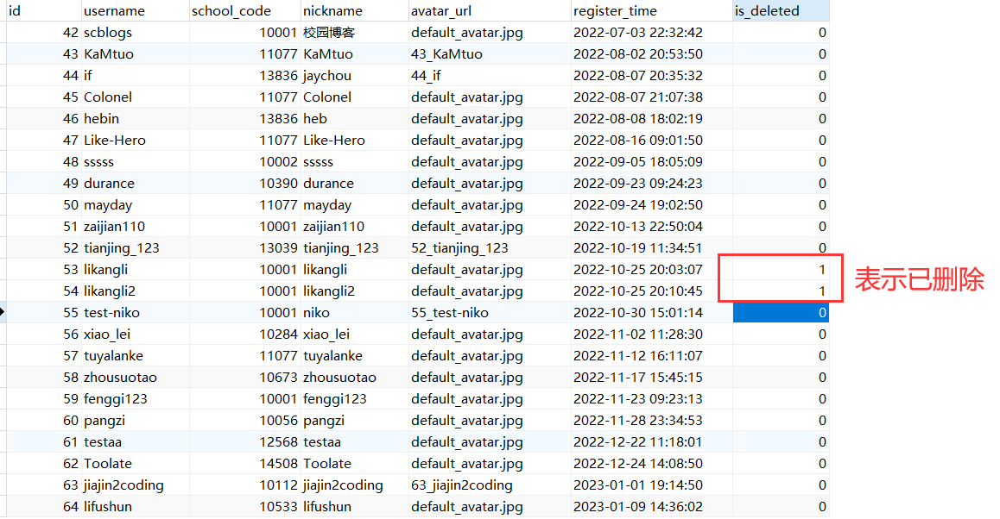

# 文章信息

**标题**

MySQL逻辑删除＋Mybatis-Plus = 墙裂推荐！

**简介**

90%的公司都在使用的逻辑删除，当搭配上Mybatis-Plus，写代码时将几乎无感，轻松的一匹！

以下正文

---

# 前言

一般情况下，我们要删除一条数据，直接使用 delete 即可，就像这样：`delete from user where id = 1`，这样做的好处是：

- 符合我们的理解，删除就是直接删掉嘛。
- 节省数据库空间，某些情况下数据量较大，且新增和删除比较频繁时，delete可以帮我们回收很多的空间。

但我今天想讲的是逻辑删除，那什么是逻辑删除呢？

# 逻辑删除

逻辑删除就是给数据表添加一个固定字段，用该字段的值来表示这条数据当前是否被删除，并把 delete 操作修改为 update 操作。

比如，在我的项目中某些表会有一个固定的 `deleted` 字段，该字段是 `tinyint` 型的，其取值只有 0 和 1 两种，0表示这条数据未删除，1表示已删除，默认值为 0。

当我要删除某条数据时，我会将这条数据的 `deleted` 值置为 1，而不会使用 delete 去真正的把它删掉。同时，我的所有 insert 语句和 update 语句都会带上一个固定的条件 `deleted = 0` ，来过滤掉所有在逻辑上被删除的数据。

> 阿里巴巴Java编码规约提出：POJO 类中布尔类型的变量，都不要加 is，否则部分框架解析会引起序列化错误。
> 
> 我原来是用的 `is_deleted`，现已全部更改为了 `deleted`。



<p align=center>△图 / 校园博客用户表数据</p>


同样的，也来讲讲这样做的好处：

- 方便数据恢复，保护数据本身的价值。
- 保证数据连续性，对主键的影响可能会导致底层B+树重建，而 delete 和 update id 都会影响主键。

事实上，在大多数公司里，都会采用逻辑删除的方式，因为数据的价值更大，被删除的数据也非常有记录价值，这样的操作也并不会提高太多的操作难度。

# 使用Mybatis-Plus逻辑删除

如果你的项目使用的是Mybatis-Plus框架来操作数据库，那你可以通过下面几个步骤快速的转变到逻辑删除模式。

1. 在MySQL中给那些要改为逻辑删除的表添加一个 `deleted` 字段，当然也可以叫 `flag` 或者是别的名字，只要你喜欢就好。类型 `tinyint` 就够了，默认值最好也设置一下。

   ```sql
   -- 你也可以直接使用这条修改语句，记得把表名进行替换
   ALTER TABLE user ADD `deleted` tinyint UNSIGNED NOT NULL DEFAULT 0 COMMENT '0为未删除，1为已删除';
   ```

2. 在你的Java代码中给刚刚修改过的表的实体类添加对应的属性：

   ```java
   public class User {
   	// 添加isDeleted字段
       Integer isDeleted;
   }
   ```

3. 在项目的配置文件（application.yml）当中添加对应的配置：

   ```yml
   mybatis-plus:
     global-config:
       db-config:
         logic-delete-field: isDeleted # 全局逻辑删除的实体字段名
         logic-delete-value: 1 # 逻辑已删除值(默认为 1)
         logic-not-delete-value: 0 # 逻辑未删除值(默认为 0)
   ```

4. 如果你的Mybatis-Plus版本在 3.3.0 以下，那你还需要在实体类的字段上添加 `@TableLogic` 注解：

   ```java
   @TableLogic
   Integer isDeleted;
   ```

5. 如果你的项目中有通过xml或者`@Update`、`@Select`等注解编写的SQL语句，那你需要自己对他们进行调整：

   - 将原有的 delete 语句统一修改为 update
   - 将原有的 select、update 语句都加一个过滤条件 `deleted = 0`
   - insert 语句，如果你在表上设置了默认值的话，则可以不用管它。如果你没有设置默认值，那我建议你还是设置一下😎。

好了就这么简单，你甚至不需要修改你的业务代码，因为Mybatis-Plus已经帮你处理好了。

## 它做了什么

- 当你调用`userMapper.deleteById(1)`的时候，实际上传到MySQL的代码是这样的：

  ```sql
  update user set deleted = 1 where id = 1 and deleted = 0
  ```

- 当你通过`QueryWrapper`查询数据或者通过 `UpdateWrapper` 更新数据的时候，它也会自动帮你添加过滤条件：

  ```sql
  select * from user where deleted = 0
  ```

- 但如果你是在xml中直接写的SQL语句，那它是不会帮你进行修改的，比如我写的SQL是这样的：

  ```xml
  <update id="deleteById">
      update user
      set deleted = ${id}
      where id = ${id}
  </update>
  ```
  
  执行出来的SQL是这样的：

  

  **很显然它并没有帮我加上 `deleted = 0` ，这是使用者需要注意的。**

当然我只是简单的对Mybatis-Plus的逻辑删除功能用法进行了简单讲解，如果你需要的话，也可以参考一下官方文档的说明：[逻辑删除 | MyBatis-Plus (baomidou.com)](https://baomidou.com/pages/6b03c5/) （虽然它写的也比较简洁👨‍💻）

# 注意

虽然把项目过渡到逻辑删除并不太费事，但它也有一些其他需要注意的点。


首先是**使用理念**上，我这里直接引用 Mybatis-Plus 的说法：

- 逻辑删除是为了方便数据恢复和保护数据本身价值等等的一种方案，但实际就是删除。
- 如果你需要频繁查出来看就不应使用逻辑删除，而是以一个状态去表示。


其次是**使用逻辑**上，对于MySQL而言，逻辑删除会导致唯一索引（UNIQUE KEY）的异常。

- 原因很简单，已经删除的数据仍然存在，当再次插入一条同样的数据时，就会抛出异常。

- 比如在我的 user 表中 username 字段设置了 UNIQUE KEY ，我先插入一条`username = 阿杆`的数据，再把这条数据逻辑删除掉，然后再重新插入一条`username = 阿杆`的数据。

  那么理论上来说此时是应该允许插入的，但由于我使用了逻辑删除，MySQL不允许存在两条数据出现同样的 `username = 阿杆`的场景，此时就出现了异常。
  
- 当然，逻辑删除与唯一索引的冲突是可以解决的，解决方案也不难。

  我们可以在原来的唯一索引里加上`deleted`字段，同时再删除数据的时候把`deleted`修改为表id，这样就可以保证未删除的数据不会出现重复值了，而且不会受到已删除数据的影响。但你要记得重写SQL方法，不然Mybatis-Plus还是会帮你修改为配置文件里的那个默认值。

  ```sql
  UNIQUE KEY `username` (`username`,`deleted`) USING BTREE
  ```

  方案不唯一，你也可以用别的方法，或者在这张表上不使用逻辑删除，毕竟，没有最好的，只有最合适的。


# 写在后面的一些话

本文是我在使用Mybatis-Plus将项目过渡到逻辑删除时写的，也算是刚接触逻辑删除这个东西，可能会有一些考虑不周全的地方，希望各位大佬在评论区提出。

另外，如果你想找一个项目参考一下逻辑删除的具体代码或者过渡方案，可以来看看我的[校园博客](https://github.com/stick-i/scblogs)项目，也可以看看我过渡时修改的代码，这几个PR就是我修改的全部代码了：

- 大部分修改的内容：[Dev 126 数据库表结构优化 by stick-i · Pull Request #132 · stick-i/scblogs (github.com)](https://github.com/stick-i/scblogs/pull/132)
- 与业务代码有关的bug：[chore: 给user_view添加deleted字段（由于其继承自user表） by stick-i · Pull Request #133 · stick-i/scblogs (github.com)](https://github.com/stick-i/scblogs/pull/133)
- 唯一索引与逻辑删除造成异常的解决：[fix: 处理user表和user_safety表的唯一索引和逻辑删除造成的冲突。 by stick-i · Pull Request #134 · stick-i/scblogs (github.com)](https://github.com/stick-i/scblogs/pull/134)

也欢迎大家来参与项目贡献或者star😋，项目地址：[https://github.com/stick-i/scblogs](https://github.com/stick-i/scblogs)


