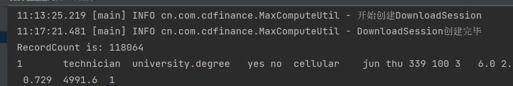
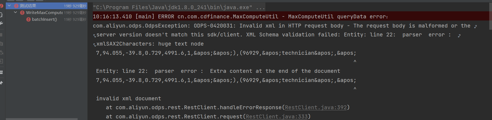

# MaxCompute存取性能调研报告，内含纯手搓SQL生成器

## 前言
前几天公司给我安排了个任务，让我去测试一下阿里云DataWork下的MaxCompute的存取性能，这不，测试报告来了。

## MaxCompute介绍
MaxCompute（ODPS）是适用于数据分析场景的企业级SaaS（Software as a Service）模式云数据仓库，以Serverless架构提供快速、全托管的在线数据仓库服务，消除了传统数据平台在资源扩展性和弹性方面的限制，最小化用户运维投入，使用户可以经济并高效地分析处理海量数据。

==MaxCompute适用于100 GB以上规模的存储及计算需求，最大可达EB级别==，并且MaxCompute已经在阿里巴巴集团内部得到大规模应用。MaxCompute适用于大型互联网企业的数据仓库和BI分析、网站的日志分析、电子商务网站的交易分析、用户特征和兴趣挖掘等。

官方学习路线：[https://www.alibabacloud.com/zh/getting-started/learningpath/maxcompute](https://www.alibabacloud.com/zh/getting-started/learningpath/maxcompute)

## 查询测试报告

### 测试方案一

**多线程SQL查询**

查询场景：

- 单表查询，只查询单字段，共610万条数据（大约100MB）
- 每次查询一万条，循环查询出所有数据（系统限制了只能一次查一万）

测试结果如下：

| 启动时间 | 线程数 | 花费时间 |
| -------- | ------ | -------- |
| 10:11    | 20     | 3m10s    |
| 10:16    | 30     | 2m28s    |
| 10:21    | 50     | 1m37s    |
| 10:23    | 70     | 1m9s     |
| 10:26    | 100    | 1m3s     |
| 10:27    | 200    | 46s      |
| 10:29    | 400    | 44s      |
| 10:30    | 500    | 43s      |

由于这波操作属于IO密集型，故提高线程数可以有效的减少花费时间，提高到100-200时性价比应该是最高的。


核心代码：
```java
	@Test
	public void test6() throws InterruptedException {
		// 查询code值
		String codeQuery = String.format("select distinct code from %s;", table);
		List<Map<String, Object>> list = MaxComputeUtil.queryData(codeQuery , true);
		log.info("获得code数据共{}条", list.size());
		// 建立线程池
		ThreadPoolExecutor pool = new ThreadPoolExecutor(20, 20, 0, TimeUnit.SECONDS, new ArrayBlockingQueue<>(500));
		for (Map<String, Object> map : list) {
			String code = (String) map.get("code");
			pool.execute(new Test(code));
		}
		pool.shutdown();
		boolean awaitTermination = pool.awaitTermination(300, TimeUnit.SECONDS);
		if (!awaitTermination) log.warn("运行超时");
		log.info("执行完毕，所有数据，共{}条", Test.count);
	}
```

```java
@Slf4j
class Test implements Runnable {

	public static long count = 0;

	private final String sql = "select code from table where code= '%s' and pt = 1;";

	private final String code ;

	public Test(String code) {
		this.code= code;
	}

	@Override
	public void run() {
		int now = 1;
		int size = 10000;
		int sum = 0;
		while (true) {
			List<Map<String, Object>> list = MaxComputeUtil.queryPageData(
			sum += list.size();
			if (list.size() < size) break;
		}
		log.info("运行完毕，共{}条数据", sum);
		count += sum;
	}

}
```


### 测试方案二

**使用TableTunnel DownloadSession 进行数据下载**

这个是官方推荐使用的批量传输通道，是一套可以查询数据和存入数据的SDK，可以用来代替SQL。

但是不知道为什么这个速度特别慢，总是卡在一个地方不动，一卡一卡的，一点也不流畅。

首先获取连接会话的时候，直接等了4分钟才连接上：



但是我同时去开启UploadSession进行数据上传，也没有像这样等待这么久，速度一般也就是一两秒，偶尔连接的时候会要10多秒。

我猜测可能是由于使用这个DownloadSession的客户端比较多，服务端资源提供不过来？或者是我们的网络和这个会话服务端的网络连接不通畅？连接上之后，每获取几条十几条数据就要等待一段时间，最终跑 118,064 条数据，花费时间13分钟，建议直接ban掉。


### 使用建议
使用方案一的多线程SQL查询，一次虽然只能查询一万条，但是多线程查询下速度还是可以接受的。


## 写入测试报告
首先我新建了一张表，表结构如下：
```sql
-- 此表结构取自官方文档：https://www.alibabacloud.com/help/zh/maxcompute/latest/use-the-maxcompute-client-create-tables#section-gwe-8vc-iwx
create table if not exists t_salary_write_test
(
    age             BIGINT comment '年龄',
    job             STRING comment '工作类型',
    marital         STRING comment '婚否',
    education       STRING comment '教育程度',
    credit          STRING comment '是否有信用卡',
    housing         STRING comment '是否有房贷',
    loan            STRING comment '是否有贷款',
    contact         STRING comment '联系方式',
    month           STRING comment '月份',
    day_of_week     STRING comment '星期几',
    duration        STRING comment '持续时间',
    campaign        BIGINT comment '本次活动联系的次数',
    pdays           DOUBLE comment '与上一次联系的时间间隔',
    previous        DOUBLE comment '之前与客户联系的次数',
    poutcome        STRING comment '之前市场活动的结果',
    emp_var_rate    DOUBLE comment '就业变化速率',
    cons_price_idx  DOUBLE comment '消费者物价指数',
    cons_conf_idx   DOUBLE comment '消费者信心指数',
    euribor3m       DOUBLE comment '欧元存款利率',
    nr_employed     DOUBLE comment '职工人数',
    fixed_deposit   BIGINT comment '是否有定期存款'
);
```

### 测试方案一
单线程，本地生成数据和SQL语句进行插入，每次插入一条数据，测试结果：

| 测试时间 | 插入数据条数 | 耗时  |
| -------- | ------------ | ----- |
| 15:08    | 20           | 1m52s |
| 15:10    | 5            | 28s   |
| 15:12    | 10           | 48s   |

这个测不动，太慢了。。。时间都花在提交任务上去了，其实执行没花多少时间。

#### 生成SQL的类
纯手搓，可以适用不同的表，主要是利用反射机制获取对象当中的字段和字段值，然后拼接成SQL语句。

需要注意对其中的特殊部分进行特殊处理，字符串之类的字段是需要添加引号的。

其实还可以再完善一下，把对象名进行读取，然后直接转化为表名，这样表名都不用传了。

实现了单数据插入和批量插入的生成方法。

```java
package com.cfpamf.salary.integretion.maxcompute;

import com.cfpamf.salary.exception.HrmsSalarySeriousException;
import lombok.extern.slf4j.Slf4j;

import java.lang.reflect.Field;
import java.util.List;

/**
 * @author 阿杆
 * @version 1.0
 * @date 2022/9/1 14:58
 */
@Slf4j
public class SqlGenerateUtil {

    /**
     * 将对象和表名转为插入数据库的SQL语句，只能处理简单数据类型
     *
     * @param object    要插入的对象数据
     * @param tableName 表名称
     * @param partition 分区，需要带上字段名和符号，例如 pt=20220901
     * @return 转换后的SQL语句
     */
    public static <T> String insert(T object, String tableName, String partition) {
        String base = "insert into %s partition (%s) (%s) values(%s);";

        StringBuilder fieldNameBuilder = new StringBuilder();
        StringBuilder fieldValueBuilder = new StringBuilder();
        // 反射获取字段内容
        Field[] fields = object.getClass().getDeclaredFields();
        for (Field field : fields) {
            // 设置字段为可读
            field.setAccessible(true);
            try {
                // 字段名
                String fieldName = field.getName();
                // 字段值
                Object fieldValue = field.get(object);
                if (fieldValue == null) {
                    continue;
                }
                fieldNameBuilder.append(fieldName).append(',');
                // 字段值
                // 需要判断是否为字符串，或者其他跟字符串类似的，这一类需要添加引号
                if (fieldValue instanceof String) {
                    fieldValueBuilder.append('\'').append(fieldValue).append('\'');
                } else {
                    fieldValueBuilder.append(fieldValue);
                }
                fieldValueBuilder.append(',');
            } catch (IllegalAccessException e) {
                String massage = "insert SQL生成异常";
                log.error(massage);
                throw new SeriousException(massage, e);
            }
        }
        // 去除后面的多余逗号
        deleteLaseComma(fieldNameBuilder);
        deleteLaseComma(fieldValueBuilder);

        String format = String.format(base, tableName, partition, fieldNameBuilder, fieldValueBuilder);
        log.debug(format);
        return format;
    }

    /**
     * 生成批量插入数据的SQL语句
     *
     * @param list      要被插入的数据
     * @param tableName 表名称
     * @param partition 分区，需要带上字段名和符号，例如 pt=20220901
     * @return 生成的SQL语句
     */
    public <T> String batchInsert(List<T> list, String tableName, String partition) {
        if (list == null || list.size() == 0 || tableName == null) {
            throw new RuntimeException("参数异常，不能为null或长度为0");
        }
        // 基础SQL
        String base = "insert into %s partition (%s) (%s) values %s ;";
        StringBuilder fieldNameBuilder = new StringBuilder();
        StringBuilder fieldValueBuilder = new StringBuilder();
        // 先搞定字段名的部分，这部分是固定的，不需要进行多次拼接
        // 反射获取字段内容
        Field[] fields = list.get(0).getClass().getDeclaredFields();
        for (Field field : fields) {
            // 设置字段为可读
            field.setAccessible(true);
            // 字段名
            fieldNameBuilder.append(field.getName()).append(',');
        }
        // 删除最后的 ','
        deleteLaseComma(fieldNameBuilder);
        try {
            // 获取字段值
            for (Object o : list) {
                fieldValueBuilder.append('(');
                for (Field field : fields) {
                    Object fieldValue = field.get(o);
                    // 需要判断是否为字符串，或者其他跟字符串类似的，这一类需要添加引号
                    if (fieldValue instanceof String) {
                        fieldValueBuilder.append('\'').append(fieldValue).append('\'');
                    } else {
                        fieldValueBuilder.append(fieldValue);
                    }
                    fieldValueBuilder.append(',');
                }
                deleteLaseComma(fieldValueBuilder);
                fieldValueBuilder.append("),");
            }
            deleteLaseComma(fieldValueBuilder);
        } catch (IllegalAccessException e) {
            String massage = "barchInsert SQL生成异常";
            log.error(massage);
            throw new SeriousException(massage, e);
        }
        String format = String.format(base, tableName, partition, fieldNameBuilder, fieldValueBuilder);
        log.debug(format);
        return format;
    }

    /**
     * 剔除最后一个多余的逗号
     */
    private static void deleteLaseComma(StringBuilder builder) {
        final char comma = ',';
        int length = builder.length();
        if (length > 0 && builder.charAt(length - 1) == comma) {
            builder.deleteCharAt(length - 1);
        }
    }

}

```


### 测试方案二
多线程，每个线程都单独插入5条数据，测试结果：

| 测试时间 | 线程数 | 耗时  |
| :------: | :----: | :---: |
|  15:20   |   2    |  25s  |
|  15:22   |   5    |  32s  |
|  15:24   |   10   |  29s  |
|  15:25   |   20   |  42s  |
|  15:26   |   50   |  52s  |
|  15:28   |  100   | 1m30s |
|  15:31   |  200   | 2m59s |
|  15:38   |  500   | 9m32s |

这个也测不动，太慢了。


### 测试方案三

使用官方SDK中的TableTunnel（UploadSession）进行批量传输（官方推荐），[https://www.alibabacloud.com/help/zh/maxcompute/latest/simple-upload](https://www.alibabacloud.com/help/zh/maxcompute/latest/simple-upload)

以下是使用单线程的传输速度。

| 测试时间 | 插入数据条数 | 耗时  |
| -------- | ------------ | ----- |
| 17:24    | 1000         | 2.5s  |
| 17:24    | 10000        | 3.3s  |
| 17:29    | 100000       | 12.4s |

这速度就很快了，前面两种方案直接ban掉。

官方文档的解释是这种传输方式建议用在上传大量数据的场景（>64M）下进行使用，因为它里面需要构建一东西，比较消耗资源（这个说明的地方我找不到了），[https://www.alibabacloud.com/help/zh/maxcompute/latest/data-upload-and-download-overview](https://www.alibabacloud.com/help/zh/maxcompute/latest/data-upload-and-download-overview)。

核心代码：
```java
    @Test
    public void uploadSessionTest() {
        int count = 1000;
        TableTunnel.UploadSession uploadSession = MaxComputeUtil.getUploadSession(tableName, "pt=1");
        // 生成TunnelBufferedWriter的实例
        try (RecordWriter recordWriter = uploadSession.openBufferedWriter()) {
            for (int i = 0; i < count; i++) {
                // 创建一条新记录和新的待插入数据
                Record record = uploadSession.newRecord();
                BankData bankData = generateData(new BankData());
                // 把数据转换到 record 对象当中
                generateRecord(record, bankData);
                // 调用write接口写入数据。
                recordWriter.write(record);
            }
            // uploadSession提交，结束上传。
        	uploadSession.commit();
        	log.info("commit ok!");
        } catch (TunnelException | IOException | IllegalAccessException e) {
            e.printStackTrace();
        }
    }
```

数据填充：

```java
    private <T> void generateRecord(Record record, T object) throws IllegalAccessException {
        // 通过反射
        Field[] fields = object.getClass().getDeclaredFields();
        for (Field field : fields) {
            field.setAccessible(true);
            record.set(field.getName(), field.get(object));
        }
    }

```

创建UploadSession的方法：

```java
	public static TableTunnel.UploadSession getUploadSession(String tableName, String partition) {
		log.info("开始创建 UploadSession");
		// 创建TableTunnel
		TableTunnel tunnel = new TableTunnel(OdpsInstance.getInstance());
		// 需要指定的分区
		PartitionSpec partitionSpec = new PartitionSpec(partition);
		TableTunnel.UploadSession uploadSession;
		try {
			uploadSession = tunnel.createUploadSession(projectName, tableName, partitionSpec);
		} catch (TunnelException e) {
			throw new RuntimeException("创建 uploadSession 失败", e);
		}
		log.info("UploadSession 创建完毕");
		return uploadSession;
	}
```


### 测试方案四
使用SQL进行批量插入，将多条插入数据的SQL拼接成一条SQL（代码在上面方案一里），单线程运行。

| 测试时间 | 插入数据条数 | 耗时  |
| :------: | :----------: | :---: |
|  10:10   |     1000     |  9s   |
|  10:11   |    10000     | 30.6s |
|  10:16   |    100000    | 报错  |

测试十万记录的报错是因为SQL太长了，导致单次发送的HTTP请求数据量过大，造成数据异常。



性能比单数据插入的性能高上了很多，但相比于官方推荐的批量传输方式还是慢了很多。

### 使用建议

==上传数据的话，如果数据量比较大（十万条数据以上），使用UploadSession进行上传是会比较好的，速度很快，如果数据量不大，那么使用批量上传的SQL也是完全可以的，虽然慢一点，但是可以减少很多不必要的资源消耗。==

这两种方式都可以使用多线程来提高速度，速度会比上面测试的要更快。


## 后记
本篇文章主要是讲MaxCompute的存取性能如何，里面的代码都是只有核心部分的，完整的代码不方便贴。不过主要还是看它的性能如何，能达到什么样的存取速度。

最后不得不说，MaxCompute做的确实很不错了，几百万条数据全部取出来只要花一分钟不到的时间，存数据也可以达到10M/s（前提是你的网速达标）。

如果本篇文章对你有帮助，欢迎点赞收藏评论关注😋，也欢迎在评论区指出文章中写的不对的和不好的地方🥰。
