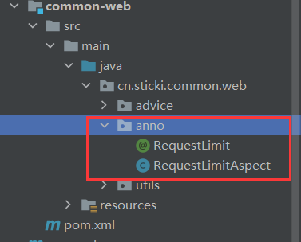
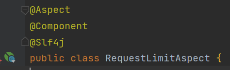
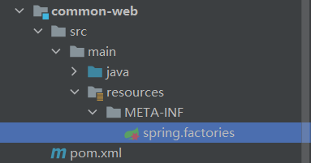
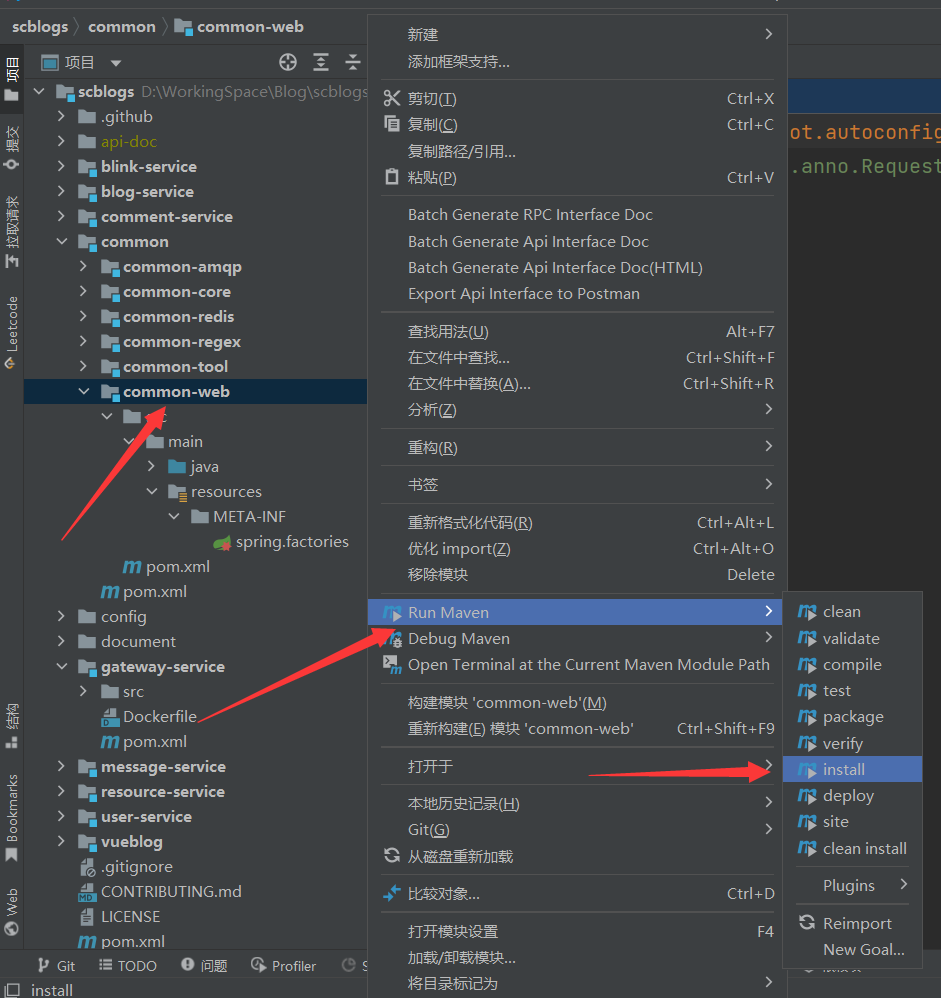
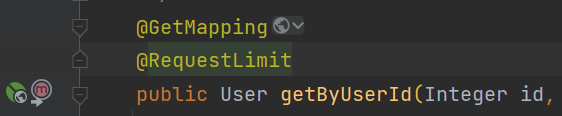
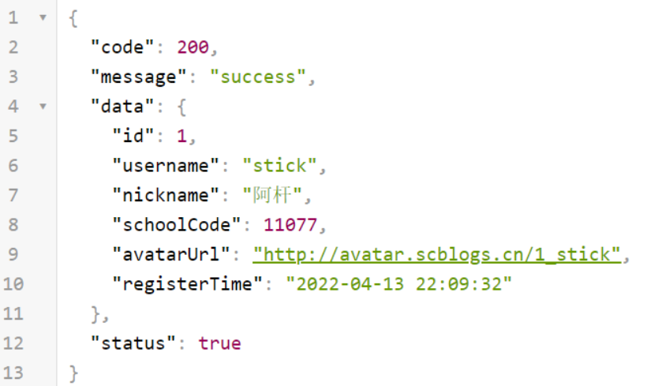
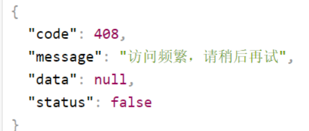
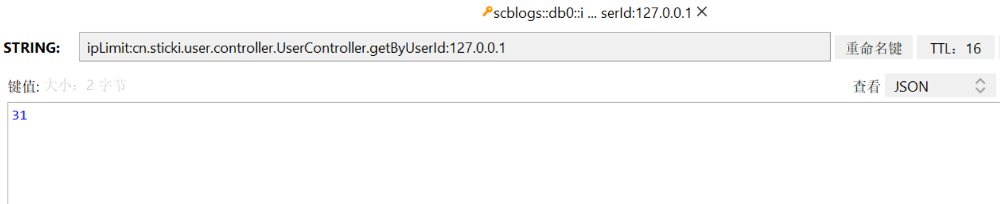

# 基于 AOP + Redis + 自定义注解 实现细粒度的接口IP访问限制

我的写法是基于 AOP + 自定义注解 + Redis，并且封装在一个单独的模块 common-web 下，需要使用的模块只需引入该包，并且给需要限制的方法添加注解即可，很方便，且松耦合😁。

唯一的缺点是该方法只支持在方法上添加注解，不支持给类添加，如果想给一个类的所有方法添加上限制，则必须给该类的所有方法都加上该注解才行🤧。...


# 系列说明
本系列文章基于我的开源微服务项目【校园博客】进行分析和讲解，所有源码均可在Gitee或GitHub上找到。
系列文章地址请见我的 [校园博客专栏](https://blog.csdn.net/little_stick_i/category_11963913.html)。

- Gitee地址：[https://gitee.com/sticki/scblogs](https://gitee.com/sticki/scblogs)
- GitHub地址：[https://github.com/stick-i/scblogs](https://github.com/stick-i/scblogs)

==目前项目还有很大改进和完善的空间，欢迎各位有意愿的同学参与项目贡献==（尤其前端），一起学习一起进步😋。

>项目的技术栈主要是：
>\
>后端 Java + SpringBoot + SpringCloud + Nacos + Getaway + Fegin + MybatisPlus + MySQL + Redis + ES + RabbitMQ + Minio + 七牛云OSS + Jenkins + Docker
>\
前端 Vue + ElementUI + Axios（说实话前端我不太清楚😅）

---

@[TOC]

---

# 前言
一般向外暴露的接口，都需要加上一个访问限制，以防止有人恶意刷流量或者爆破，访问限制的做法有很多种，从控制粒度上来看可以分为：全局访问限制和接口访问限制，本文讲的是接口访问的限制。

本章讲解的主要内容在项目中的位置：scblogs / common / common-web / src / main / java / cn / sticki / common / web / anno /

我的写法是基于 ==AOP + 自定义注解 + Redis==，并且封装在一个单独的模块 `common-web` 下，需要使用的模块只需引入该包，并且给需要限制的方法添加注解即可，很方便，且松耦合😁。

唯一的缺点是该方法只支持在方法上添加注解，不支持给类添加，如果想给一个类的所有方法添加上限制，则必须给该类的所有方法都加上该注解才行🤧。
如果有同学想把这个缺点完善一下，欢迎到文章顶部的git链接中访问并加入我们的项目😋。

---

# 实现步骤
## 一、引入依赖
实现这个功能我们主要需要 Redis 和 AOP的依赖，redis我们用spring的，然后aop使用org.aspectj下的aspectjweaver，主要就是下面这两个
```xml
		<dependency>
			<groupId>org.springframework.boot</groupId>
			<artifactId>spring-boot-starter-data-redis</artifactId>
		</dependency>

		<dependency>
			<groupId>org.aspectj</groupId>
			<artifactId>aspectjweaver</artifactId>
		</dependency>
```

PS：我的项目文件中引入的是我自己的 common-redis 模块，里面包含了 spring redis的依赖。


## 二、写注解

新建一个包，命名为anno，然后在包下新建注解，命名为`RequestLimit`，再新建一个类，命名为`RequestLimitAspect`，如下图：




然后我们先写注解的内容：

```java
package cn.sticki.common.web.anno;

import org.springframework.core.Ordered;
import org.springframework.core.annotation.Order;

import java.lang.annotation.*;

/**
 * Request 请求限制拦截
 *
 * @author 阿杆
 * @version 1.0
 * @date 2022/7/31 20:19
 */
@Retention(RetentionPolicy.RUNTIME)
@Target(ElementType.METHOD)
@Documented
@Order(Ordered.HIGHEST_PRECEDENCE)
public @interface RequestLimit {

	/**
	 * 允许访问的次数，默认值120
	 */
	int count() default 120;

	/**
	 * 间隔的时间段，单位秒，默认值60
	 */
	int time() default 60;

	/**
	 * 访问达到限制后需要等待的世界，单位秒，默认值120
	 */
	int waits() default 120;

}

```

说明：
- 这里我们设置@Target(ElementType.METHOD)，意思是这个注解只能使用在方法上。
- 设置@Order(Ordered.HIGHEST_PRECEDENCE)，是为了让这个注解的的优先级升高，也就是先判断访问限制，再做其他的事情。
- 然后注解内的参数，是用于不同接口下设置不同的限制的，使用者可以根据接口的需求，进行设置。


## 三、写逻辑（注解环绕）
我们现在基于`RequestLimit`注解写环绕运行的逻辑，也就是开始写 `RequestLimitAspect` 的内容了，下面都是在这个类中进行操作的。

### 1. 添加注解

给刚刚新建的 `RequestLimitAspect`类上使用 `@Aspect` ，因为等会我们还要把这个类自动注入到Spring当中，所以还得给它加上 `@Component` 注解。




### 2. 注入 RedisTemplate
由于我们是要把访问次数记录在redis中的（分布式嘛），所以我们肯定得有 redis 的工具类。

那么问题来了，我们这是个工具模块，本身并不会被启动，也没有启动类，更没有什么配置文件，那这种情况下，我们该如何获得redis呢？

答案是：找引入我们的的模块要 RedisTemplate。==因为这些Bean都是被spring管控的，包括RedisTemplate，也包括我们现在写的RequestLimitAspect ，它们将来都是在spring容器内的，所以我们直接在代码里找spring进行注入就可以了。将来引入我们的模块中如果有RedisTemplate可用，那我们自然就可以拿到。==

所以这步很简单，直接注入即可，但是不要忘了定义一个key前缀，等会用来拼接到redis的key上。
```java
	@Resource
	private RedisTemplate<String, Integer> redisTemplate;
	
	private static final String IPLIMIT_KEY = "ipLimit:";
```

### 3. 定义方法

在类中定义一个`before`方法，并在方法上使用`@Around()` 注解，Around内填入之前新建的 `RequestLimit` 的全路径名，做到这一步，代码就会像我这样：
```java
package cn.sticki.common.web.anno;

import lombok.extern.slf4j.Slf4j;
import org.aspectj.lang.ProceedingJoinPoint;
import org.aspectj.lang.annotation.Around;
import org.aspectj.lang.annotation.Aspect;
import org.springframework.data.redis.core.RedisTemplate;
import org.springframework.stereotype.Component;

import javax.annotation.Resource;

/**
 * @author 阿杆
 * @version 1.0
 * @date 2022/7/31 20:24
 */
@Aspect
@Component
@Slf4j
public class RequestLimitAspect {

	@Resource
	private RedisTemplate<String, Integer> redisTemplate;

	private static final String IPLIMIT_KEY = "ipLimit:";

	/**
	 * 拦截有 {@link RequestLimit}注解的方法
	 */
	@Around("@annotation(cn.sticki.common.web.anno.RequestLimit)")
	public Object before(ProceedingJoinPoint pjp) throws Throwable {
		return pjp.proceed();
	}

}

```

### 4. 实现方法
步骤：
1. 获取注解参数
2. 获取当前请求的ip
3. 生成key
4. 获取redis中该key的访问次数
5. 判断次数是否超过范围
   - 若超出范围，则拒绝访问，返回提示，并将TTL重置为注解上的等待时间
   - 若没有超过范围，则允许访问，并将访问次数+1
   - 若查询不到该key，则往redis中进行添加，将值设置为1，将TTL设置为注解上的值

完整实现代码如下（内容干净无毒，可以放心CV，仅需将返回值进行修改）：

```java
package cn.sticki.common.web.anno;

import cn.sticki.common.result.RestResult;
import cn.sticki.common.web.utils.RequestUtils;
import cn.sticki.common.web.utils.ResponseUtils;
import lombok.extern.slf4j.Slf4j;
import org.aspectj.lang.ProceedingJoinPoint;
import org.aspectj.lang.annotation.Around;
import org.aspectj.lang.annotation.Aspect;
import org.aspectj.lang.reflect.MethodSignature;
import org.springframework.data.redis.core.RedisTemplate;
import org.springframework.stereotype.Component;
import org.springframework.web.context.request.RequestContextHolder;
import org.springframework.web.context.request.ServletRequestAttributes;

import javax.annotation.Resource;
import javax.servlet.http.HttpServletRequest;
import java.lang.reflect.Method;
import java.util.concurrent.TimeUnit;

/**
 * @author 阿杆
 * @version 1.0
 * @date 2022/7/31 20:24
 */
@Aspect
@Component
@Slf4j
public class RequestLimitAspect {

	@Resource
	private RedisTemplate<String, Integer> redisTemplate;

	private static final String IPLIMIT_KEY = "ipLimit:";

	/**
	 * 拦截有 {@link RequestLimit}注解的方法
	 */
	@Around("@annotation(cn.sticki.common.web.anno.RequestLimit)")
	public Object before(ProceedingJoinPoint pjp) throws Throwable {
		MethodSignature signature = (MethodSignature) pjp.getSignature();
		// 1. 获取被拦截的方法和方法名
		Method method = signature.getMethod();
		String methodName = signature.getDeclaringTypeName() + "." + signature.getName();
		log.debug("拦截方法{}", methodName);
		// 1.2 获取注解参数
		RequestLimit limit = method.getAnnotation(RequestLimit.class);
		// 2. 获取当前线程的请求
		ServletRequestAttributes attribute = (ServletRequestAttributes) RequestContextHolder.getRequestAttributes();
		if (attribute == null) {
			log.warn(this.getClass().getName() + "只能用于web controller方法");
			return pjp.proceed();
		}
		HttpServletRequest request = attribute.getRequest();
		// 2.2 获取当前请求的ip
		String ip = RequestUtils.getIpAddress(request);
		// 3. 生成key
		String key = IPLIMIT_KEY + methodName + ":" + ip;
		// 4. 获取Redis中的数据
		Integer count = redisTemplate.opsForValue().get(key);
		int nowCount = count == null ? 0 : count;
		if (nowCount >= limit.count()) {
			// 5. 超出限制，拒绝访问
			assert attribute.getResponse() != null;
			log.info("访问频繁被拒绝访问，ip:{}，method:{}", ip, signature.getName());
			ResponseUtils.objectToJson(attribute.getResponse(), RestResult.fail("访问频繁"));
			if (nowCount == limit.count()) {
				// 5.2 重置Redis时间为设定的等待值
				log.debug("重置redis值为{}，等待{}", nowCount + 1, limit.waits());
				redisTemplate.opsForValue().set(key, nowCount + 1, limit.waits(), TimeUnit.SECONDS);
			}
			return null;
		}

		if (count == null) {
			// 重置计数器
			log.debug("重置计数器");
			redisTemplate.opsForValue().set(key, 1, limit.time(), TimeUnit.SECONDS);
		} else {
			// 计数器 +1，不重置TTL
			redisTemplate.opsForValue().increment(key);
		}
		log.debug("方法放行");
		return pjp.proceed();
	}

}

```

### 5. 开启spring自动装配
spring会自动注入`spring.factories`文件中的类，所以我们只需要编写`spring.factories`即可。

首先在resources下新建META-INF文件夹，然后在该文件夹下新建文件，命名为`spring.factories`。




文件内容如下：

```
org.springframework.boot.autoconfigure.EnableAutoConfiguration=\
  cn.sticki.common.web.anno.RequestLimitAspect
```
==这里的全限定名需要改为自己的类路径名。==


## 四、测试
1. 把刚刚写的那个模块用maven进行本地打包

  

  

2. 然后在其他服务中引入该模块为依赖，对需要进行访问限制的方法使用。

  

  

3. 运行项目

4. 访问该接口进行测试
   -  刚开始正常
   
    
   
    
   
   - 多次访问之后被拒绝

     

     

   - 查看redis数据，发现符合我设定的条件

     

     


# 总结

本文讲解了如何在微服务中优雅的实现一个公用的接口访问限制工具。

如果你有兴趣学习微服务，欢迎订阅我的专栏和关注我。如果你想在项目中提升自己，欢迎来github加入我的项目，也欢迎私聊我😋。

如果本文中有任何不妥或者错误的地方，欢迎大家批评指正🥰。