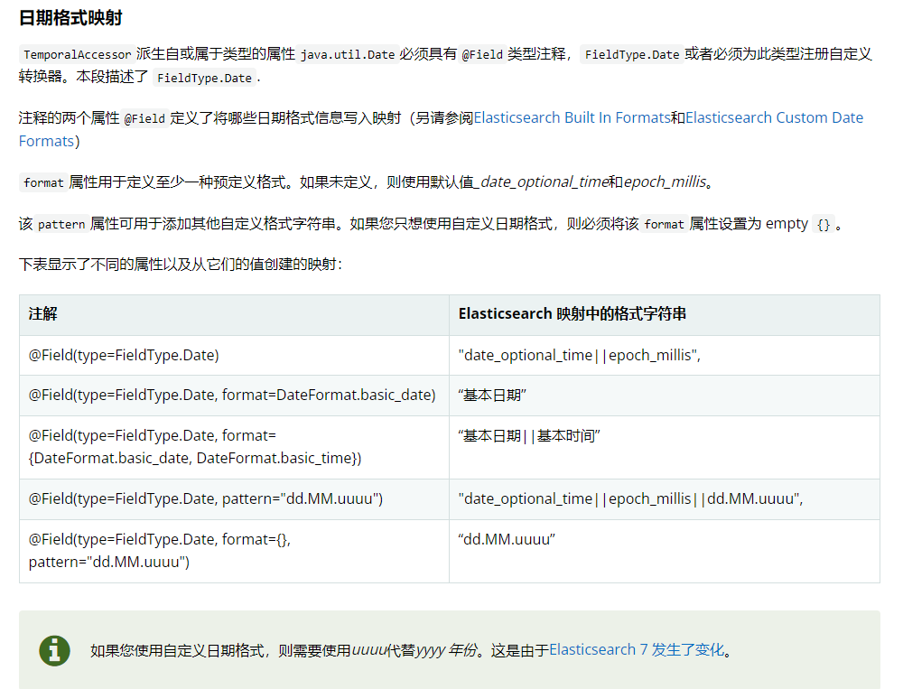
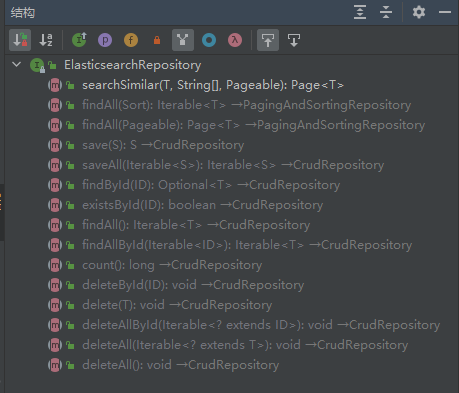
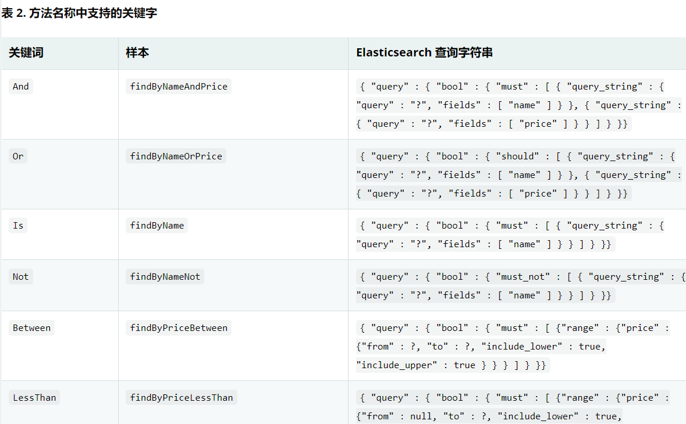
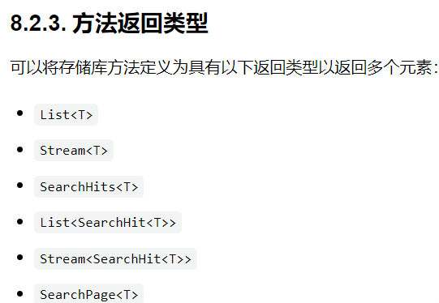
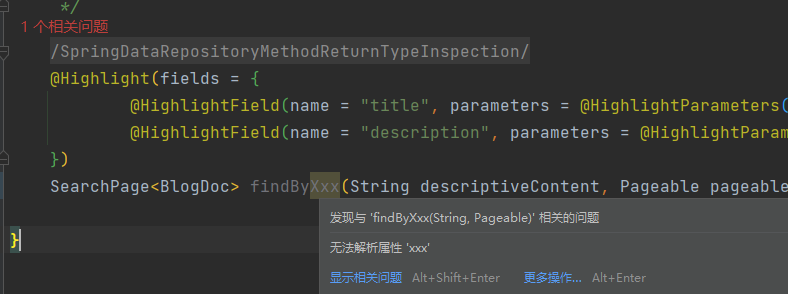
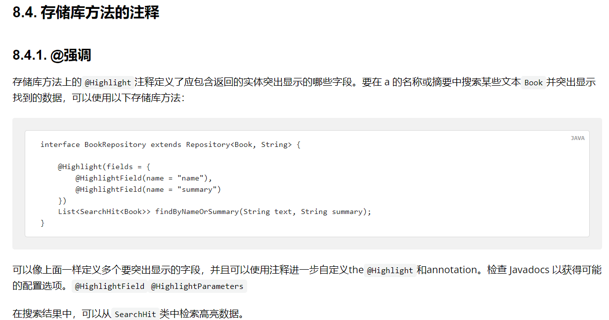

# 基于Spring-Data-Elasticsearch 优雅的实现 多字段搜索 + 高亮 + 分页 + 数据同步

# 系列说明

本系列文章基于我的开源微服务项目【校园博客】进行分析和讲解，所有源码均可在GitHub仓库上找到。
系列文章地址请见我的 [校园博客专栏](https://juejin.cn/column/7149909884270542856)。

- GitHub地址：[https://github.com/stick-i/scblogs](https://github.com/stick-i/scblogs)

**目前项目还有很大改进和完善的空间，欢迎各位有意愿的同学参与项目贡献**（尤其前端），一起学习一起进步😋。

>项目的技术栈主要是：
>\
>后端 Java + SpringBoot + SpringCloud + Nacos + Getaway + Fegin + MybatisPlus + MySQL + Redis + ES + RabbitMQ + Minio + 七牛云OSS + Jenkins + Docker
>\
>前端 Vue + ElementUI + Axios（说实话前端我不太清楚😅）


# 前言

> 本篇文章讲的内容是在项目的 /blog-service/blog-content-server 路径下，感兴趣的同学欢迎随时查看，觉得不错的话也欢迎点点star噢。

为了给项目添加一个好的搜索功能，我去学习了一下elasticsearch。

在学习elasticsearch-client的期间，发现它提供的api不太优雅，用起来也不太舒服，而且我觉得有些操作完全是可以封装在内部的，比如获取数据后，对数据转化为bean的操作；还有属性高亮，不仅设置比较麻烦，而且设置完成的高亮居然是单独在一个字段里的，需要开发者去手动的替换才行，这些操作我觉得其实都可以封装在内部的，害，个人感慨，请勿介意。

然后我就去看了一下spring-data里面提供的 es 操作库，发现有很多操作都封装的比较完善，使用起来也比较优雅，于是我便使用spring-data-elasticsearch完成了这个功能，查阅了很多资料、博客、官方文档，有些地方我觉得官方文档讲的也不够详细，导致走了很多弯路，也可能是我没有找到详细的文档。

为了方便大家学习和少走弯路，也便于本人日后回顾，故记录于此，主要是一些使用上的记录和讲解，对原理和基础知识并没有介绍。


# 技术要点

1. 使用 *copyTo* 和  *ElasticsearchRepository* 完成的多字段搜索。
2. 使用注解 *@Highlight* 和 *@HighlightField* 完成的高亮显示。
3. 使用 *Pageable* 和 *SearchPage* 实现分页和高亮两不误的接口。
4. 使用 *RabbitMQ* 完成 *MySQL* 和 *elasticsearch* 的数据同步。

# 依赖项

我当前的环境：

- springboot 2.6.6

- elasticsearch 7.12

- kibana 7.12（这个不是必须的）

- 然后当前版本的spring默认是用的 7.15.2 的我担心和我的es不兼容，就加了个标签给它改了一下版本： 

  ```xml
  <elasticsearch.version>7.12.1</elasticsearch.version>
  ```

  

核心依赖其实就这一个，这里面已经依赖了elasticsearch需要的一些依赖，例如 `elasticsearch-rest-high=level-client`。

```xml
		<dependency>
			<groupId>org.springframework.boot</groupId>
			<artifactId>spring-boot-starter-data-elasticsearch</artifactId>
		</dependency>
```

然后如果跟我一样使用 `RabbitMQ` 做数据同步的话，还需要引用mq的依赖：

```xml
		<!--AMQP依赖，包含RabbitMQ-->
		<dependency>
			<groupId>org.springframework.boot</groupId>
			<artifactId>spring-boot-starter-amqp</artifactId>
		</dependency>
		<!-- json序列化依赖，需要手动配置bean -->
		<dependency>
			<groupId>com.fasterxml.jackson.core</groupId>
			<artifactId>jackson-databind</artifactId>
		</dependency>
```


# 配置文件

这里需要配置elasticsearch的账号密码

```yaml
spring:
  elasticsearch:
    uris: "http://localhost:9200"
    username: 12345
    password: 12345
```


# 核心代码

## 实体类BlogDoc

下面是我代码当中跟 es 进行交互的实体类，代码上有相关的注释，我将一些多余的、意义不大的属性删掉了，方便大家查看。

```java
package cn.sticki.blog.content.pojo;

import com.fasterxml.jackson.annotation.JsonIgnore;
import lombok.Data;
import org.springframework.data.annotation.Id;
import org.springframework.data.elasticsearch.annotations.Document;
import org.springframework.data.elasticsearch.annotations.Field;
import org.springframework.data.elasticsearch.annotations.FieldType;

import java.util.Date;

/**
 * Blog ES文档类型
 *
 * @author 阿杆
 * @version 1.0
 * @date 2022/7/8 15:24
 */
@Data
@Document(indexName = "blog")
public class BlogDoc {

	/**
	 * 博客id
	 */
	@Id
	Integer id;

	/**
	 * 封面图链接
	 */
	@Field(type = FieldType.Keyword, index = false)
	String coverImage;

	/**
	 * 标题
	 */
	@Field(type = FieldType.Text, analyzer = "ik_max_word", copyTo = "descriptiveContent")
	String title;

	/**
	 * 描述
	 */
	@Field(type = FieldType.Text, analyzer = "ik_max_word", copyTo = "descriptiveContent")
	String description;

	/**
	 * 创建时间
	 */
	@Field(type = FieldType.Date, pattern = "uuuu-MM-dd HH:mm:ss")
	Date createTime;

	/**
	 * 发表状态（1表示已发表、2表示未发表、3为仅自己可见、4为回收站、5为审核中）
	 */
	@Field(type = FieldType.Integer)
	Integer status;

	/**
	 * 由其他属性copy而来，主要用于搜索功能，不需要储存数据
	 */
	@JsonIgnore
	@Field(type = FieldType.Text, analyzer = "ik_max_word", ignoreFields = "descriptiveContent", excludeFromSource = true)
	String descriptiveContent;

}

```

### 注解说明：

- @Document(indexName = "blog")：声明该实体类对应es中的哪个**索引库**。

- @Id：声明该字段对应索引库当中的id。

- @JsonIgnore：这个应该很熟悉吧，就是**在json序列化时将对象中的一些属性忽略掉，使返回的json数据不包含该属性**。

- @Field(...) ，这些其实都**对应es的api调用时传入的字段**，有一点es基础会很容易看懂，也可以看看我写的elasticsearch专栏下的其他文章，前几篇是我学基础的时候记录的。
  - type = FieldType.Integer ：声明字段属性，如果不写，默认为auto，就是es会帮你自动匹配成最合适的字段类型，建议还是写一下。
  
  - index = false ：声明该字段不需要建立索引，一般用于不会被拿来搜索、排序、统计的字段，比如我这里写的封面图链接。
  
  - analyzer = "ik_max_word" ： 声明该text字段需要使用的分词器，我这里是用的ik分词器，需要开发者去手动安装，但对中文分词比较友好。
  
  - excludeFromSource = true：翻译出来意思是“从源中排除”，应该是指这个字段的属性不会插入到es索引库当中吧，这个字段是我用来``copy_to`的，主要是搜索的时候使用，本身并不会直接存入数据，所以这个字段如果有数据，我希望插入的时候把它忽略。
  
  - copyTo = "descriptiveContent"：这个就是跟es的copy_to一样，就是说把当前属性拷贝到“descriptiveContent”当中，可以拷贝多个属性到同一个字段中，便于搜索、查询。
  
  - pattern = "uuuu-MM-dd HH:mm:ss" ： 声明该自定义的格式字符串，一般在type = FieldType.Date时使用。
  
  - format：跟pattern差不多，官方解释是用于定义至少一种预定义格式。如果未定义，则使用默认值*_date_optional_time*和*epoch_millis*。也就是只能使用给定的枚举值，不能自定义，自定义的话得用pattern。下图是谷歌翻译的官方解释：
  
    


### 实体类属性copy_to

大家都知道，在es当中如果有多个字段需要被同时查询（比如我的博客业务，要搜索内容的时候，我会把用户输入的关键字同时拿来匹配标题和文章描述），那可以用*multi_match*、*query_string*进行多字段查询，也可以用*copy_to*将多个字段复制到一个新属性上再去查新属性，这几种方法都是可以的，但是copy_to它的性能会高一些，尤其是在同时要查的属性非常多的时候，这属于是一种储存换取速度的方式。

*copy_to*的属性在上面已经讲过了，跟es的api用来起来差不多的，但是我上面的代码还写了一个`descriptiveContent`：

```java
	/**
	 * 由其他属性copy而来，主要用于搜索功能，不需要储存数据
	 */
	@JsonIgnore
	@Field(type = FieldType.Text, analyzer = "ik_max_word", ignoreFields = "descriptiveContent", excludeFromSource = true)
	String descriptiveContent;
```

这个属性就是被cope_to到的那个属性，但实际上我们在写代码的时候并不会给它赋值或者取值或者别的怎么样，总是就是希望他尽可能透明，仅在对es时有效，因为es里是已经提前定义好这个索引库了的，es创建索引库的代码我会贴在文章最后。

这是因为，后面我们要使用*ElasticsearchRepository*的时候，被查询的字段如果不存在于这个实体类，idea会有一个很碍眼的提示，~~作为强迫症患者~~，这就引发了我的思考，是不是我们在定义实体类的时候，要和定义索引库的时候一样给出全部的字段呢？尽管这个字段只是一个“隐身”的字段。~~为了把这个碍眼的提示去掉~~ 为了让代码变得更可读一点，所以我加上了这个字段，并加了一些忽略的属性使它尽可能隐身。


## Mapper层（Repository）

核心代码如下，具体解释和分析在下面：

```java
package cn.sticki.blog.content.mapper;

import cn.sticki.blog.content.pojo.BlogDoc;
import org.springframework.data.domain.Pageable;
import org.springframework.data.elasticsearch.annotations.Highlight;
import org.springframework.data.elasticsearch.annotations.HighlightField;
import org.springframework.data.elasticsearch.annotations.HighlightParameters;
import org.springframework.data.elasticsearch.core.SearchPage;
import org.springframework.data.elasticsearch.repository.ElasticsearchRepository;

/**
 * BlogRepository操作类
 * 提供save、findById、findAll、count、delete、exists等接口
 *
 * @author 阿杆
 * @version 1.0
 * @date 2022/7/9 10:53
 */
public interface BlogRepository extends ElasticsearchRepository<BlogDoc, Long> {

	/**
	 * 通过描述内容来搜索博客
	 *
	 * @param descriptiveContent 描述语句
	 * @param pageable           分页
	 * @return 博客列表
	 */
	@SuppressWarnings("SpringDataRepositoryMethodReturnTypeInspection")
	@Highlight(fields = {
			@HighlightField(name = "title", parameters = @HighlightParameters(requireFieldMatch = false)),
			@HighlightField(name = "description", parameters = @HighlightParameters(requireFieldMatch = false)),
	})
	SearchPage<BlogDoc> findByDescriptiveContent(String descriptiveContent, Pageable pageable);

}
```

### 继承ElasticsearchRepository

1. 这个其实就有点像继承*BaseMapper*，它会给你提供一些基础的CRUD方法，方便你直接使用，比如save、delete、find之类的。

   
   
   


2. 它是个泛型类，两个参数分别是**<实体类，id的类型>**。

3. 在该接口下（BlogRepository）按照特殊的命名规则声明的方法，可以直接调用，不需要开发者实现接口，且它返回的内容是已经封装好的，**你需要的数据会被封装在你提供的实体类里面**（不用手动解析数据）。

   大概就是 *findByXxxAndXxxOrXxx()* 这个类型，具体的可以参考官网：[https://docs.spring.io/spring-data/elasticsearch/docs/4.3.5/reference/html/#elasticsearch.query-methods.criterions](https://docs.spring.io/spring-data/elasticsearch/docs/4.3.5/reference/html/#elasticsearch.query-methods.criterions)，这里也截一点给大家看看（谷歌浏览器翻译的）：

   
   
   


4. 也可以使用 *@Query* 注解写原生的 api 请求接口，不太优雅，个人不推荐使用。

然后这里我只添加了一个方法：

```java
SearchPage<BlogDoc> findByDescriptiveContent(String descriptiveContent, Pageable pageable);
```

这个意思就是所通过 `DescriptiveContent` 属性来查询数据，后面的两个参数一个是搜索的内容，一个是分页的参数（分页需要配合支持分页的返回值才行）。

这个findByXxx的Xxx属性必须是实体类里面存在的属性才可以，不然会提示错误：




### 高亮显示

```java
	@SuppressWarnings("SpringDataRepositoryMethodReturnTypeInspection")
	@Highlight(fields = {
			@HighlightField(name = "title", parameters = @HighlightParameters(requireFieldMatch = false)),
			@HighlightField(name = "description", parameters = @HighlightParameters(requireFieldMatch = false)),
	})
```

使用注解 *@Highlight* 和 *@HighlightField*，来设置高亮的字段，使用 *@HighlightParameters* 来添加高亮的参数。

我这里设置了requireFieldMatch = false，这个参数是**取消只有字段匹配才给高亮的规则**，这是因为我搜索的字段是由另外两个字符copyTo而来的，高亮的内容肯定是在另外两个字段里面，设置该参数可以让其他字段的高亮也展示出来。

这里还有一篇高亮显示的教程文章，我讲的比较粗糙，他这个写的比较详细，贴给大家学习：[https://blog.csdn.net/qq_45794678/article/details/111188548](https://blog.csdn.net/qq_45794678/article/details/111188548)

官方文档给的说明就这么点。。。~~怕我学会了然后教别人吗~~。。。




### 分页功能

通过 *Pageable* 做参数和 *SearchPage* 做返回值来完成了对分页的需求，传参的时候使用 `PageRequest.of(page, size)` 来创建分页参数即可。

得到结果后仅需将分页的内容替换掉实体类的内容即可，并且数据里面包含有获取页码的信息的接口：


## Service层

核心代码如下：

```java
@Service
public class BlogContentServiceImpl implements BlogContentService {

	@Resource
	private BlogRepository blogRepository;

	/**
	 * 搜索博客
	 *
	 * @param key 搜索内容
	 * @param page 页码
	 * @param size 页大小
	 * @return 搜索到的结果列表
	 */
	@Override
	public List<BlogDoc> searchBlog(String key, int page, int size) {
		// 1. 获取数据
		SearchPage<BlogDoc> searchPage = blogRepository.findByDescriptiveContent(
				// 1.1 设置key和分页，这里是从第0页开始的，所以要-1
				key,PageRequest.of(page - 1, size));
		// 2. 高亮数据替换
		List<SearchHit<BlogDoc>> searchHitList = searchPage.getContent();
		ArrayList<BlogDoc> blogDocList = new ArrayList<>(searchHitList.size());
		for (SearchHit<BlogDoc> blogHit : searchHitList) {
			// 2.1 获取博客数据
			BlogDoc blogDoc = blogHit.getContent();
			// 2.2 获取高亮数据
			Map<String, List<String>> fields = blogHit.getHighlightFields();
			if (fields.size() > 0) {
				// 2.3 通过反射，将高亮数据替换到原来的博客数据中
				BeanMap beanMap = BeanMap.create(blogDoc);
				for (String name : fields.keySet()) {
					beanMap.put(name, fields.get(name).get(0));
				}
			}
			// 2.4 博客数据插入列表
			blogDocList.add(blogDoc);
		}
		return blogDocList;
	}

}
```

### 替换高亮数据

到这里其实就只要做一件事了，因为Repository返回的数据已经帮你封装好实体类了，不需要再去json转bean了，它唯一的缺点就是，高亮数据还是得自己去做替换，所以我上面这些代码也就是做了这一件事，就是把高亮的数据替换掉原来的数据。

这里我用到了 *BeanMap*，代码里不用写死属性名称，相对来说更优雅一点，如果有需要的话，也可以把中间这一段分离成一个单独的方法，可以提供给不同的类使用。


## 数据同步

数据同步指的是 *elasticsearch* 和 *MySQL* 的数据同步，由于我的项目做的是微服务架构，我的**博客服务**和**博客内容服务**是两个微服务（本文讲的是博客内容服务），博客服务提供文章的**增删改查**功能，并连接MySQL，博客内容服务提供**搜索功能**，并连接ES，故两者的数据需要同步。

这里我使用的是RabbitMQ，主要逻辑如下：

1. 用户新建修改或删除博客时，博客服务发送消息到MQ中，发到自己的交换机里，并指定key。
2. 内容服务提前创建队列并绑定到博客服务的交换机中。
3. 当内容服务接收到消息时，做出对应的操作。

核心代码如下：

```java
/**
 * 内容服务对博客服务的消息队列监听器
 *
 * @author 阿杆
 * @version 1.0
 * @date 2022/7/10 9:32
 */
@Slf4j
@Component
public class BlogServerListener {

	@Resource
	private BlogRepository blogRepository;

	@RabbitListener(bindings = @QueueBinding(
			exchange = @Exchange(name = BLOG_EXCHANGE),
			value = @Queue(name = BLOG_SAVE_QUEUE),
			key = {BLOG_INSERT_KEY, BLOG_UPDATE_KEY}
	))
	public void saveListener(BlogDoc blogDoc) {
		log.debug("save blogDoc，{}", blogDoc);
		blogRepository.save(blogDoc);
	}

	@RabbitListener(bindings = @QueueBinding(
			exchange = @Exchange(name = BLOG_EXCHANGE),
			value = @Queue(name = BLOG_DELETE_QUEUE),
			key = BLOG_DELETE_KEY
	))
	public void deleteListener(Long blogId) {
		log.debug("delete blog ,id->{}", blogId);
		blogRepository.deleteById(blogId);
	}

}
```

其实可以看出，通过Repository来实现这些操作都是很简单的。

需要注意的是，这里的save操作，是**ES的全量更新**，所以发送过来的数据，一定要是完整的数据，否则会导致部分字段丢失。

然后发送消息的大概就是代码是：

```java
rabbitTemplate.convertAndSend(BLOG_EXCHANGE, BLOG_UPDATE_KEY, blog);
```


### MQ序列化配置
这里RabbitMQ的序列化配置我也贴一下，这个可以让MQ消息变成json格式的。

```java
package cn.sticki.common.amqp.autoconfig;

import org.springframework.amqp.support.converter.Jackson2JsonMessageConverter;
import org.springframework.amqp.support.converter.MessageConverter;
import org.springframework.context.annotation.Bean;
import org.springframework.context.annotation.Configuration;

/**
 * @author 阿杆
 * @version 1.0
 * @date 2022/6/25 18:01
 */
@Configuration
public class AmqpMessageConverterConfig {

	@Bean
	public MessageConverter messageConverter() {
		return new Jackson2JsonMessageConverter();
	}

}
```


# 后记

本篇文章主要使用了 *ElasticsearchRepository* 和相关注解来完成了一些常有的需求，比较优雅（个人认为）的实现了查询分页和高亮的功能（网上找到的教程都没有把分页和高亮一起适配的🤧）。但如果有更为复杂的需求，可能还是需要使用*ElasticsearchRestTemplate*来完成。
官网：[https://docs.spring.io/spring-data/elasticsearch/docs/4.3.5/reference/html/#elasticsearch.operations.resttemplate](https://docs.spring.io/spring-data/elasticsearch/docs/4.3.5/reference/html/#elasticsearch.operations.resttemplate) 
