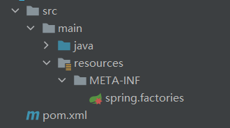

# 【开源微服务项目】论如何在微服务中优雅的实现Redis序列化配置

由于微服务所涉及的模块较多，每个模块都是一个单独的服务，如果我们有多个服务需要使用到redis的话，每个服务都做一次redis序列化配置，那重复的代码是很多的。所以我们可以把配置抽离出来作为一个单独的模块，提供给其他需要的模块使用，以此来达到解耦和代码复用的效果。

# 系列说明
本系列文章基于我的开源微服务项目【校园博客】进行分析和讲解，所有源码均可在Gitee或GitHub上找到。
系列文章地址请见我的 [校园博客专栏](https://blog.csdn.net/little_stick_i/category_11963913.html)。

- Gitee地址：[https://gitee.com/sticki/scblogs](https://gitee.com/sticki/scblogs)
- GitHub地址：[https://github.com/stick-i/scblogs](https://github.com/stick-i/scblogs)


>项目的技术栈主要是：
>\
>后端 Java + SpringBoot + SpringCloud + Nacos + Getaway + Fegin + MybatisPlus + MySQL + Redis + ES + RabbitMQ + Minio + 七牛云OSS + Jenkins + Docker
>\
前端 Vue + ElementUI + Axios（说实话前端我不太清楚😅）

目前项目还有很大改进和完善的空间，欢迎各位有意愿的同学参与项目贡献（尤其前端），一起学习一起进步😋。

---

@[TOC]

---

# 前言
>本章讲解的主要内容在项目中的位置： scblogs / common / common-redis / src / main / java / cn / sticki / common / redis / autoconfig /

由于微服务所涉及的模块较多，每个模块都是一个单独的服务，如果我们有多个服务需要使用到redis的话，每个服务都做一次redis序列化配置，那重复的代码是很多的。

所以我们可以==把配置抽离出来作为一个单独的模块==，提供给其他需要的模块使用，以此来达到解耦和代码复用的效果。

我想到的实现方式有两种：
- 第一种是通过自定义注解配合 @import() 来导入redis序列化的配置，使用的时候引入依赖+使用注解即可
- 第二种是通过 spring.factories 文件来自动导入，使用的时候直接引入依赖就会有效果

本文两种都有讲到，可以根据自己的需求选择，我个人更倾向于使用注解的，虽然说是麻烦了些，但是灵活性更好。当然，具体使用哪种还是要根据项目的情况来选择。

# 步骤
## 一、引入依赖
核心依赖是spring-boot-starter-data-redis，其他的根据自己的情况引入。

```xml
		<dependency>
			<groupId>org.springframework.boot</groupId>
			<artifactId>spring-boot-starter-data-redis</artifactId>
		</dependency>
```

## 二、编写序列化配置
redis的序列化配置我们一般喜欢使用String的配置，以字符串的形式存入redis，方便我们查看。

所以我这里的配置代码主要是以string为核心的配置，具体配置请见代码：
```java
package cn.sticki.common.redis.autoconfig;

import org.springframework.context.annotation.Bean;
import org.springframework.context.annotation.Configuration;
import org.springframework.data.redis.connection.RedisConnectionFactory;
import org.springframework.data.redis.core.RedisTemplate;
import org.springframework.data.redis.serializer.GenericJackson2JsonRedisSerializer;
import org.springframework.data.redis.serializer.RedisSerializer;

/**
 * Redis默认序列化配置
 *
 * @author 阿杆
 * @version 1.0
 * @date 2022/6/17 22:22
 */
@Configuration
public class RedisSerializeDefaultConfig {

	@Bean
	public RedisTemplate<String, Object> redisTemplate(RedisConnectionFactory connectionFactory) {
		// 创建RedisTemplate对象
		RedisTemplate<String, Object> template = new RedisTemplate<>();
		// 设置连接工厂
		template.setConnectionFactory(connectionFactory);
		// 创建JSON序列化工具
		GenericJackson2JsonRedisSerializer jsonRedisSerializer = new GenericJackson2JsonRedisSerializer();
		// 设置Key的序列化
		template.setKeySerializer(RedisSerializer.string());
		template.setHashKeySerializer(RedisSerializer.string());
		// 设置Value的序列化
		template.setValueSerializer(jsonRedisSerializer);
		template.setHashValueSerializer(jsonRedisSerializer);
		// 返回
		return template;
	}

}

```

当然，如果你有自己的序列化需求或者想法，也可以使用其他的方式进行配置，总之只要是能用的就行，因为这一步并不是关键。

==注意redisTemplate方法要使用@Bean进行配置，然后这个 RedisSerializeDefaultConfig 类要使用@Configuration配置，不然后面无法注入到spring容器，就不会生效。==

## 三、注入容器
### 方式一：自定义注解
先贴代码，下面根据代码进行讲解：
```java
package cn.sticki.common.redis.autoconfig;

import org.springframework.context.annotation.Import;

import java.lang.annotation.*;

/**
 * Redis默认序列化配置开关
 *
 * @author 阿杆
 */
@Target(ElementType.TYPE)
@Retention(RetentionPolicy.RUNTIME)
@Documented
@Import(RedisSerializeDefaultConfig.class)
public @interface EnableRedisSerialize {

}
```

注解内容很简单，但是可以实现我们想要的功能。

这里的核心是 `@Import(RedisSerializeDefaultConfig.class)` ，如果有地方使用了这个注解，那么它会自动注入 `RedisSerializeDefaultConfig.class` 到spring容器中，也就是我们上面写的序列化配置类。
随后我们的配置类有会将我们自定义的RedisTemplate注入到容器中，这样我们的配置就生效了。

使用的时候只需要在Spring的启动类上加上这个注解，就会使配置生效，不加就不生效，比如这样：
```java
package cn.sticki.gateway;

import cn.sticki.common.redis.autoconfig.EnableRedisSerialize;
import org.springframework.boot.SpringApplication;
import org.springframework.boot.autoconfigure.SpringBootApplication;

/**
 * @author 阿杆
 */
@EnableRedisSerialize // 开启我们设置的Redis序列化配置
@SpringBootApplication
public class GatewayServerApplication {

	public static void main(String[] args) {
		SpringApplication.run(GatewayServerApplication.class, args);
	}

}
```

### 方式二：spring.factories自动装配
spring启动时会自动注入`spring.factories`文件中的类，所以我们只需要编写`spring.factories`即可。

首先在resources下新建META-INF文件夹，然后在该文件夹下新建文件，命名为`spring.factories`。




文件内容如下：
```
org.springframework.boot.autoconfigure.EnableAutoConfiguration=\
  cn.sticki.common.redis.autoconfig.RedisSerializeDefaultConfig
```
**这里的全限定名需要改为自己的类路径名**，然后引入这个包的模块就会自动注入你写的redis序列化配置，也很方便。

我的项目中用的是第一种方法，大家如果遇到问题也可以参考我的项目代码，git仓库链接在文章顶部。

# 总结

微服务中多模块之间的协调工作是很重要的。

如果你有兴趣学习微服务，欢迎订阅我的专栏和关注我。如果你想在项目中提升自己，欢迎来git仓库找我，也欢迎私聊我😋。

如果本文中有任何不妥或者错误的地方，欢迎大家批评指正🥰。
