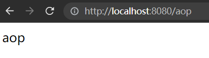

# 过滤器、拦截器、AOP、ControllerAdvcie的使用对比、执行顺序及代码教程

# 前言

本文适合有一定基础的同学，在已有的认识基础上对这四块的知识做一个总体的对比。

本文基于SpringBoot项目进行讲解，所有的代码都是在已经搭好SpringBoot的基础上进行编写的，SpringBoot版本为2.7.3。

该项目所有的代码都已经上传到我的GitHub仓库：https://github.com/stick-i/Filter_Interceptor_AOP_Advcie

# 过滤器Filter

## 简介

- 来自J2EE中的Servlet技术
- 实现原理：基于servlet的函数回调实现
- 只可以获取到请求中的request和response，无法获取到响应方法的信息
- 可以拦截所有请求
- 支持使用xml配置和注解配置
- 应用场景：权限认证、敏感词检测、访问日志记录等

## 使用方法

1. 实现 `Filter` 接口，重写 `doFilter` 方法；

2. 放行请求时调用`chain.doFilter()`方法；

3. 启用该过滤器，有三种方式，一种是比较原始的xml配置，这我就不写了，需要的同学请查看其它人的文章。

   第二种是使用注解 `@WebFilter()` ，并在启动类上添加`@ServletComponentScan`注解使用。

   第三种是直接使用`@Component`注解，这样的话@WebFilter配置的路径会失效，因为@WebFilter根本就没生效，不信自己去试试😘。

   ==下面我使用的是第二种方式，更灵活==

4. 设置拦截路径，就是要拦截的那个url路径。

## 代码实现

**过滤器代码**

```java
@Slf4j
@WebFilter(value = "/name") //这里我们只拦截name请求，记得要在启动类配ServletComponentScan
public class MyFilter implements Filter {

	@Override
	public void doFilter(ServletRequest request, ServletResponse response, FilterChain chain) throws ServletException, IOException {
		log.info("before filter");
		// 请求放行
		chain.doFilter(request, response);
		log.info("after filter");
	}

}
```

**Controller代码**

```java
@Slf4j
@RestController
public class MyController {

	@GetMapping("/name")
	public String getName() {
		log.info("getName");
		return "sticki";
	}

}
```


## 测试

发送请求


查看控制台，可以观察到执行的顺序是按照我们代码中的前后顺序来执行的。


# 拦截器Interceptor

## 简介

- 来自Spring，不依赖于servlet容器，但依赖于Spring
- 实现原理：通过反射机制，动态代理实现

- 可以获取到Spring中存在的Bean，通过注入的方式
- 只对action请求起作用，并可以获取到action请求的上下文
- 应用场景：访问日志、权限管理等（场景这块感觉跟过滤器差不多）

## 使用方法

1. 实现 `HandlerInterceptor `接口 或 继承 `HandlerInterceptorAdapter` 类，建议使用接口；
2. 实现 `preHandle` 方法（在处理请求前运行），实现 `postHandle` 方法（在处理请求完毕后运行）；
3. 再新建一个类，继承 `WebMvcConfigurer` 接口，再实现`addInterceptors`方法，并在方法中注册该拦截器、配置拦截路径（不配置默认拦截所有请求）；

## 代码实现

**拦截器代码**

```java
@Slf4j
public class MyInterceptor implements HandlerInterceptor {

	@Override
	public boolean preHandle(HttpServletRequest request, HttpServletResponse response, Object handler) {
		log.info("before interceptor");
		return true;
	}

	@Override
	public void postHandle(HttpServletRequest request, HttpServletResponse response, Object handler, ModelAndView modelAndView) {
		log.info("after interceptor");
	}

}
```

**配置类代码**

```java
@Configuration
public class InterceptorConfig implements WebMvcConfigurer {

	@Override
	public void addInterceptors(InterceptorRegistry registry) {
        // 只拦截 age 的请求
		registry.addInterceptor(new MyInterceptor()).addPathPatterns("/age");
	}

}
```

**Controller代码**，还是刚刚那个Controller，不过我添加了一个新的请求 /age

```java
	@GetMapping("/age")
	public Integer getAge() {
		log.info("getAge");
		return 22;
	}
```

## 测试

发送请求


查看控制台


# ControllerAdvice

## 简介

- 来自Spring，依赖于Spring
- 应用场景：全局异常处理（配合自定义异常效果更佳）、数据绑定、数据预处理
- 可以使用注解@ControllerAdvice，实现 ResponseBodyAdvice、RequestBodyAdvice 等接口，用于web项目的返回数据加强。


## 使用方法

1. 创建一个类，给类加上注解`@RestControllerAdvice`
2. 写一个方法，给方法加上注解 `@ExceptionHandler(Exception.class)` ，括号里写要拦截的异常，方法的参数也是这个异常或者这个异常的父类
3. 在方法中写对该异常的处理

ps：这里我只写了全局异常处理的代码，需要的同学可以去查一查其他的使用方法噢，也可以看一下这个：https://www.cnblogs.com/tiancai/p/14871319.html ，写的挺全的。

## 代码实现

**ControllerAdvice**

```java
@Slf4j
@RestControllerAdvice
public class ExceptionAdvice {

	@ExceptionHandler(Exception.class)
	public String allExceptionHandler(Exception e) {
		log.warn(e.getMessage()); // 捕获之后打印异常信息
		return "系统异常，请稍后再试";
	}

}
```

**Controller代码**，也是新加了一个请求 /exception

```java
	@GetMapping("/exception")
	public String getException() {
		log.info("getException");
		throw new RuntimeException("报错啦");
	}
```

## 测试

发送请求，可以看到这里的信息是返回的 ControllerAdvice 里面的，而不是Controller里面的。


查看控制台


# AOP

## 简介

- AOP是一种面向切面编程的实现，实现的方式还挺多的，有SpringAOP，也有AspectJ、CGLIB等
- 实现原理：基于动态代理或静态代理
- 细粒度的拦截，可以获取到切入方法的参数等上下文数据，配合注解使用非常的舒服
- 应用场景：一般用于方法的加强，比如方法级别的权限控制、日志输出、读取写入缓存、方法调用次数限制等

## 使用方法

1. 创建一个类，给类加上`@Aspect` 和 `@Component`注解
2. 定义切入点 `@Pointcut()` ，可以定义在注解上（使用注解的类或方法即切入点），也可以直接指定切入的范围
3. 根据需要定义 `@Before("pointcut()")` 和 `@After("pointcut()")`，然后在内部写处理逻辑

ps：这里我只写了spring aop的使用，需要的同学自己去百度找其他的使用方法噢

## 代码实现

**AOP代码**

```java
@Slf4j
@Aspect
@Component
public class MyAop {

	/**
	 * 仅匹配getAop这一个方法
	 */
	@Pointcut("execution(* cn.sticki.test.controller.MyController.getAop())")
	public void pointcut() {

	}

	@Before("pointcut()")
	public void before() {
		log.info("aop before");
	}

	@After("pointcut()")
	public void after() {
		log.info("aop after");
	}

}
```

最左边会有个小符号😎


**Controller代码**，添加一个新的方法

```java
	@GetMapping("/aop")
	public String getAop() {
		log.info("getAop");
		return "aop";
	}
```

## 测试

发送请求



查看控制台


完全没问题😋


# 四者的执行顺序

好，既然我们四个都写完了，那就再加一点东西，让他们四个同时处理到一个方法上，那我们就可以测试出四者的执行顺序了🤣。

添加了几个方法，这里直接给大家截图了，需要的同学可以去仓库拿代码。

**Controller代码**


**AOP代码**


**Filter配置加了一条**


**Interceptor配置也加一条**


**最后Advice是不用加的**

---

**准备完毕**，然后就可以去测试了。

发送请求：


控制台：


## 结论

可以看到，执行顺序是：Filter过滤器 > Interceptor拦截器 > ControllerAdvice > AOP。

解释：Filter和Interceptor的执行顺序是可以直接看出来的，AOP、ControllerAdvice 的执行顺序得看getAll的后面，getAll是controller输出的内容嘛，它的下一条是aop，然后才是异常被捕获，反方向先执行，说明 ControllerAdvice 是在 AOP 外面一层的。

这里也可以看出来，==当抛出的异常被 ControllerAdvice 捕获之后， Interceptor 拦截器不会再有后置处理了，但是Filter过滤器还是有后置处理的==。

这里画了张图便于大家理解：


# 总结

这四者其实都是面向切面编程思想的一种实现。具体使用选择的话建议根据项目需要，参考它们的特性及执行顺序，选择最合适的一个或多个进行使用👴。


