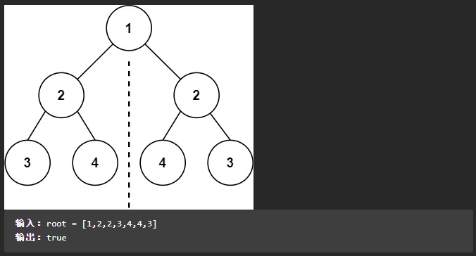
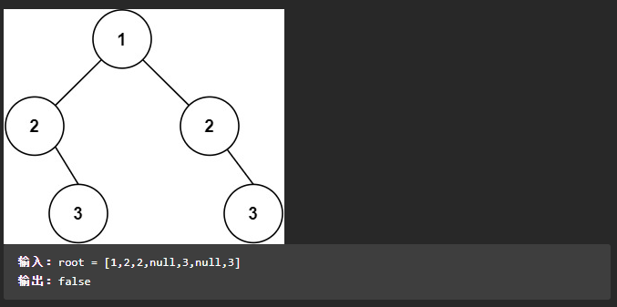
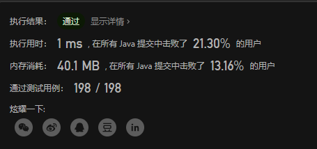

## LeetCode 101. 对称二叉树

### 题目描述

给你一个二叉树的根节点 `root` ， 检查它是否轴对称。

**提示：**

- 树中节点数目在范围 `[1, 1000]` 内
- `-100 <= Node.val <= 100`

**示例1**



**示例2**



### 解题思路

我看完题目后的第一反应就是，这居然是一道简单题！感觉至少也算是中等难度吧，我想了十几分钟才想到解题的方法。。。

1. 首先要知道，题目需要求证的只是根节点的左子树和右子树是否对称，而不是要求每一个节点的左子树和右子树是否对称。
2. 这样一来，我们可以提前把这两个子数的数值全部存下来，然后再对比他们的值是否相同，即可得出答案。
3. 那我们应该如何以什么样的方式去保存子树的值呢？==既然左右子树是对称的，那左子树的前序遍历就会和右子树的后序遍历相同。==能想到这一点，这题其实知道该怎么做了。
4. ==另外我们还需要考虑空节点值的情况，空节点可能导致这两种遍历方式在同一棵树下遍历出相同的结果==，比如示例2的左右子树，前序遍历和后续遍历的值就是一样的，但实际上他们并不对称。所以我们需要把空值也存起来，以保证他们的顺序。
5. 前序遍历和后续遍历可以通过递归的方式来实现。
6. 还有另一种递归方式，不需要提前存值再校验就可以得出答案，留给各位朋友在评论区进行讨论。


### Java代码

```java
class Solution {
    public boolean isSymmetric(TreeNode root) {
        List<Integer> leftList = new ArrayList<>();
        List<Integer> rightList = new ArrayList<>();

        dfs(root.left, leftList, true);
        dfs(root.right, rightList, false);

        if (leftList.size() != rightList.size()) {
            return false;
        }
        for(int i = 0 ;i < leftList.size() ;i++) {
            // 这题因为节点的值在正负100以内，所以我直接用 != 来判断了
            if (leftList.get(i) != rightList.get(i)) {
                return false;
            }
        }
        return true;
    }

    private void dfs(TreeNode node, List<Integer> list, boolean isLeft) {
        if (node == null) {
            list.add(null);
            return ;
        }
        list.add(node.val);
        if (isLeft) {
            dfs(node.left, list, isLeft);
            dfs(node.right, list, isLeft);
        } else {
            dfs(node.right, list, isLeft);
            dfs(node.left, list, isLeft);
        }
    }
}
```

排名不太妙哈哈哈哈，原题链接：https://leetcode.cn/problems/symmetric-tree/submissions/




## 15. 三数之和

### 题目描述

**输入样例**

**输出样例**

**题目链接**

### 解题思路

如果我们先求出所有的两数之和的情况，那他们可能有再用这些情况去匹配


### 代码

```java

```