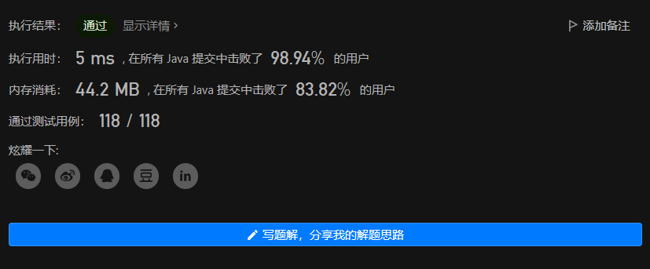

# LeetCode 49. 字母异位词分组

原题链接：[49. 字母异位词分组 - 力扣（LeetCode）](https://leetcode.cn/problems/group-anagrams/submissions/)

题目难度：中等

## 题目描述

给你一个字符串数组，请你将 **字母异位词** 组合在一起。可以按任意顺序返回结果列表。

**字母异位词** 是由重新排列源单词的字母得到的一个新单词，所有源单词中的字母通常恰好只用一次。


**示例 1:**

```
输入: strs = ["eat", "tea", "tan", "ate", "nat", "bat"]
输出: [["bat"],["nat","tan"],["ate","eat","tea"]]
```

**示例 2:**

```
输入: strs = [""]
输出: [[""]]
```

**示例 3:**

```
输入: strs = ["a"]
输出: [["a"]]
```

 

**提示：**

- `1 <= strs.length <= 104`
- `0 <= strs[i].length <= 100`
- `strs[i]` 仅包含小写字母


## 解题思路

这题题目有点绕，我用大白话翻译一下，就是要**把组成字母相同的字符串放在同一个列表里就行了**。

很显然是需要使用哈希来解题的，我们只需要将组成字母相同的字符串使用同一个kay存入到HashMap当中就可以了。只不过哈希的值只能和字符串内的字母组成相关，且不能与组成的顺序相关。

下面针对这题提供两种哈希的方法。

### 加与乘

首先我们把每个字符串中每个字母都当成一个数字来看。

根据我们中学（或者小学）学习的加法交换律和乘法交换律，可以知道多个数字之间相加相乘的结果是与其顺序无关的，故我们可以让字符串中的每个字母的值相乘或相加。

由于单独使用乘法或加法会出现不符合预期的情况，比如：`2 * 3 = 1 * 6 = 6` 或 `1 + 5 = 3 + 3 = 6`，这种情况下我们不希望得出相同的哈希值。

故我选择同时使用加法和乘法，可以极大的减小碰撞的概率。

核心代码如下：

```java
long hash(String str) {
    if (str.equals("")) return -1;
    long ans = 1;
    // 先全部相乘
    for (int i = 0; i < str.length(); i++) {
        ans *= str.charAt(i);
    }
    // 再全部相加
    for (int i = 0; i < str.length(); i++) {
        ans += str.charAt(i);
    }
    return ans;
}
```

### 字母排序

当我们将字符串中的字母进行统一排序后，得到的值同样会与其组成顺序无关，且比加法乘法更加可靠。

只需要先将字符串转换成字符数组，对其进行排序后再转换成字符串，并作为key即可。

核心代码如下：

```java
String hash(String str) {
    char[] array = str.toCharArray();
    Arrays.sort(array);
	return new String(array);
}
```

## 完整解题代码 Java

上面的哈希算法可以二选一，都能过题。

```java
class Solution {
    public List<List<String>> groupAnagrams(String[] strs) {    
		HashMap<Long, List<String>> map = new HashMap<>();
		for (String str : strs) {
			long key = hash(str);
			List<String> list = map.getOrDefault(key, new ArrayList<>());
			list.add(str);
			map.put(key, list);
		}
		return new ArrayList<>(map.values());
	}

	long hash(String str) {
        if (str.equals("")) return -1;
		long ans = 1;
		for (int i = 0; i < str.length(); i++) {
			ans *= str.charAt(i);
		}
		for (int i = 0; i < str.length(); i++) {
			ans += str.charAt(i);
		}
		return ans;
	}
}
```

通过截图：




