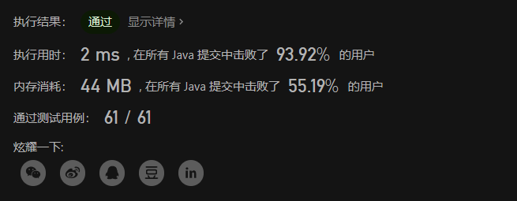

# LeetCode 64. 最小路径和

原题链接：[64. 最小路径和](https://leetcode.cn/problems/minimum-path-sum/)

题目难度：中等

## 题目描述

给定一个包含非负整数的 `m x n` 网格 `grid` ，请找出一条从左上角到右下角的路径，使得路径上的数字总和为最小。

**说明：**每次只能向下或者向右移动一步。

 

**示例 1：**


```
输入：grid = [[1,3,1],[1,5,1],[4,2,1]]
输出：7
解释：因为路径 1→3→1→1→1 的总和最小。
```

**示例 2：**

```
输入：grid = [[1,2,3],[4,5,6]]
输出：12
```

 

**提示：**

- `m == grid.length`
- `n == grid[i].length`
- `1 <= m, n <= 200`
- `0 <= grid[i][j] <= 100`


## 解题思路

这题是动态规划中比较简单的题型了，但是力扣给他的难度定位是中等哈哈哈，估计是个dp就算中等。

1. 根据题目说明 **每次只能向下或者向右移动一步**，很明显是可以用dp（即动态规划）来做的，而且状态变化公式也非常明显，就差直接告诉你 **“每个格子可以由上面或者左边的格子过来”** 这句话了。
2. 题目要求出从起点到终点路径数字总和最小的值，那很明显就是取上面和左边两个格子的最小值了，状态公式也很明显了：`dp[i][j] = dp[i][j] + Math.min(dp[i][j-1], dp[i-1][j]);`
3. 需要注意的是边界处理，当`i == 0`时或当`j == 0`时，是不用比较最小值的，因为只有一条路走，没得选择。还需要注意`i`和`j`都等于0的时候，这是起点，不需要加任何值。

## 完整解题代码 Java

```java
class Solution {
    public int minPathSum(int[][] grid) {
        int m = grid.length;
        int n = grid[0].length;
        for (int i = 0 ; i < m; i++){
            for (int j = 0 ; j < n ; j++){
                if (i == 0 && j == 0) continue;
                else if (j == 0) grid[i][j] += grid[i-1][j];
                else if (i == 0) grid[i][j] += grid[i][j-1];
                else grid[i][j] += Math.min(grid[i-1][j] , grid[i][j-1]);
            }
        }
        return grid[m-1][n-1];
    }
}
```


通过截图：



## 同类题型推荐

写LeetCode热题TOP100时我还遇到了几道跟这题很类似的题目，但是都比较简单，就不是太想写题解了。一并分享给大家，拿去练练手，掌握相似题型。

- [62. 不同路径 - 力扣（LeetCode）](https://leetcode.cn/problems/unique-paths/) 难度：中等
- [70. 爬楼梯 - 力扣（LeetCode）](https://leetcode.cn/problems/climbing-stairs/) 难度：简单


