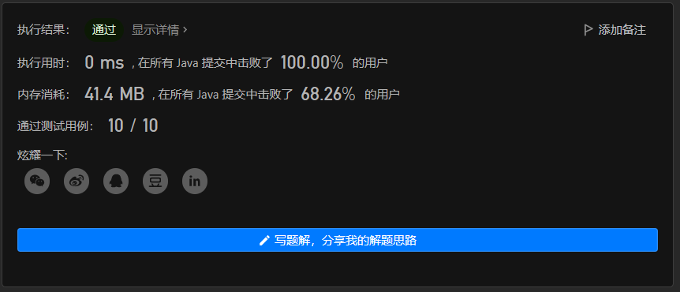

# LeetCode 78. 子集

原题链接：[78. 子集 - 力扣（LeetCode）](https://leetcode.cn/problems/subsets/)

题目难度：中等

## 题目描述

给你一个整数数组 `nums` ，数组中的元素 **互不相同** 。返回该数组所有可能的子集（幂集）。

解集 **不能** 包含重复的子集。你可以按 **任意顺序** 返回解集。

 

**示例 1：**

```
输入：nums = [1,2,3]
输出：[[],[1],[2],[1,2],[3],[1,3],[2,3],[1,2,3]]
```

**示例 2：**

```
输入：nums = [0]
输出：[[],[0]]
```

 

**提示：**

- `1 <= nums.length <= 10`
- `-10 <= nums[i] <= 10`
- `nums` 中的所有元素 **互不相同**


## 解题思路

> PS：这里先写的是思考过程中的错误解法，没有兴趣的同学可以直接跳过哈哈哈🤣

这题还是有点意思的，我第一眼看上去就觉得是用递归去做，递归的内部循环每一个元素，循环中去移出元素，之后递归，再把刚移出的元素添加进去。

想法很简单，思路很明确，于是直接开始写代码，核心代码如下：

```java
List<List<Integer>> ans = new ArrayList<>();

void trade(List<Integer> list) {
    ans.add(new ArrayList<>(list));
    if (list.size() == 0) {
        return;
    }
    ArrayList<Integer> temp = new ArrayList<>(list);
    for (Integer num : temp) {
        list.remove(num);
        trade(list);
        list.add(num);
    }
}
```

结果执行用例就出现了问题，发现存在大量重复元素，因为这个方法对前面递归的状态没有关系，即使在循环中移出过的元素，再下一层循环的下一层递归中仍有可能被继续移出。

比如集合【1,2,3】：

1. 最外层递归的第一次循环：移出1  递归->  移出2  递归->  移出3，产生的列表有 [2,3],[3]
2. 最外层递归的第二次循环：移出2  递归->  移出1  递归->  移出3，产生的列表有 [1,3],[3]

如此便产生了两个[3]。

---

### 解法一：递归状态

仍然还是递归，但我们可以把思路转换成，每一个数字都只有两种状态，被选择和不被选择，这样一来，便可以找到所有子集，且不重复。

1. 构建一个Stack，用于存储当前已经选择了的元素。（因为用栈方便我删除刚刚存储的元素，恢复状态）

2. 循环每一个元素，对于每一个元素，有如下两种状态

   1. 选择该元素，那么将元素值入栈，再调用函数递归

   2. 不选择该元素，由于刚刚已经入栈了，所以我们需要出栈一次，然后再继续递归。

      这里出栈的同时也保证了栈在本层递归中的状态被还原，不会影响上一层递归的操作。

3. 当所有元素都被处理过一遍了，不管是选择了还是没选择，那都会得出一个唯一的栈序列，此时将该栈深拷贝一份，并且作为列表存入答案中。

核心代码如下：

```java
public List<List<Integer>> subsets(int[] nums) {
    this.nums = nums;
    List<Integer> list = Arrays.stream(nums).boxed().collect(Collectors.toList());
    trade(list);
    return ans;
}

int[] nums;

Stack<Integer> stack = new Stack<>();

List<List<Integer>> ans = new ArrayList<>();

void doit(int i) {
    if (i == nums.length) {
        // 当所有数字都选择完后，保存当前状态
        ans.add(new ArrayList<>(stack));
        return;
    }
    // 选择当前元素
    stack.push(nums[i]);
    doit(i + 1);
    // 不选择当前元素
    stack.pop();
    doit(i + 1);
}
```


### 解法二：二进制类比

对于上一种解法，我们知道每个元素都只有两种状态，如果我们将这两种状态用0,1表示，那题目所需要求出的答案，就像可以类比成这样的序列：

000、001、010、100、011、110、101、111

把他们排好看点：

000、001、010、011、100、101、110、111

不容易发现😅，这其实正是0、1、2、3、4、5、6、7的二进制值。

这样一来，我们只需要把一个数字不断递增，再递增的过程中使用其二进制求出每一个对应的元素序列，就可以得到答案，简直绝了😥。

而我们递增的次数，就是2的序列长度次方。

核心代码如下：

```java
public List<List<Integer>> subsets(int[] nums) {
    int n = (int) Math.pow(2, nums.length);
    List<List<Integer>> ans = new ArrayList<>();
    for (int i = 0; i < n; i++) {
        ArrayList<Integer> list = new ArrayList<>();
        // t 用来求二进制的每一位是否为1
        // j 用来取序列的下标
        for (int t = i, j = 0; t != 0; t >>= 1, j++) {
            if ((t & 1) == 1) {
                list.add(nums[j]);
            }
        }
        ans.add(list);
    }
    return ans;
}
```


通过截图：




