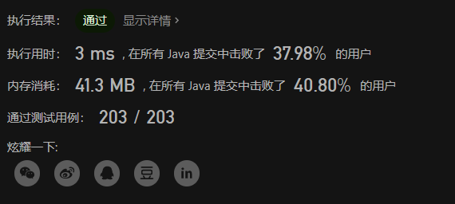
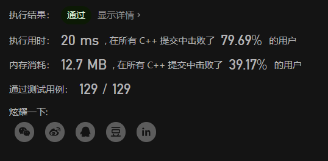

# LeetCode 剑指 Offer 重建二叉树、二维数组中的查找


# 重建二叉树
输入某二叉树的前序遍历和中序遍历的结果，请构建该二叉树并返回其根节点。
假设输入的前序遍历和中序遍历的结果中都不含重复的数字。

**示例 1:**


```
Input: preorder = [3,9,20,15,7], inorder = [9,3,15,20,7]
Output: [3,9,20,null,null,15,7]
```

**示例 2:**

```
Input: preorder = [-1], inorder = [-1]
Output: [-1]
```

**限制：**

`0 <= 节点个数 <= 5000`

**题目链接**
https://leetcode.cn/problems/zhong-jian-er-cha-shu-lcof/


## 前置知识
二叉树前序遍历的顺序为：
- 先遍历根节点；
- 随后递归地遍历左子树；
- 最后递归地遍历右子树。

二叉树中序遍历的顺序为：
- 先递归地遍历左子树；
- 随后遍历根节点；
- 最后递归地遍历右子树。

## 解题思路

这题我用的是递归的思路，每个节点都有两个孩子节点（有的为NULL），所以我只需要一直去找当前节点的孩子节点就可以了。

步骤：
1. 构造当前节点
2. 找到当前节点在中序遍历数组中的位置
3. 将数组分为两份，以第二步找到的位置为界限，左边这份为左子树的，右边为右子树的
4. 判断是否有左子树或者右子树，将子树的边界和下标进行递归

## 代码

```java
class Solution {

    int[] preorder;

    int[] inorder;

    public TreeNode buildTree(int[] preorder, int[] inorder) {
        if (preorder.length == 0) {
            return null;
        }
        this.preorder = preorder;
        this.inorder = inorder;
        return dfs(0, 0, preorder.length);
    }

    // 返回当前字数的根节点
    // index：当前节点所在先序遍历数组中的位置
    // left：所在中序遍历的左边界，right为右边界，这里为左开右闭区间
    public TreeNode dfs(int index, int left, int right) {
		int now = preorder[index];
		TreeNode node = new TreeNode(preorder[index]);
		int inorderIndex = 0;
		// 找到当前节点在中序遍历数组中的位置
		for (int i = left; i < right; i++) {
			if (now == inorder[i]) {
				inorderIndex = i;
				break;
			}
		}
		if (inorderIndex > left) {
			// 左节点在先序遍历一定位于当前节点的下一个，故index + 1即可
			node.left = dfs(index + 1, left, inorderIndex);
		}
		if (inorderIndex < right - 1) {
			// 右节点的偏移位数，要根据左子树中共有多少个节点来判断
			int dev = inorderIndex - left + 1;
			node.right = dfs(index + dev, inorderIndex + 1, right);
		}
		// 返回当前节点
		return node;
    }
}
```



# 二维数组中的查找
在一个 n * m 的二维数组中，每一行都按照从左到右递增的顺序排序，每一列都按照从上到下递增的顺序排序。请完成一个高效的函数，输入这样的一个二维数组和一个整数，判断数组中是否含有该整数。

示例:

现有矩阵 matrix 如下：

```
[
  [1,   4,  7, 11, 15],
  [2,   5,  8, 12, 19],
  [3,   6,  9, 16, 22],
  [10, 13, 14, 17, 24],
  [18, 21, 23, 26, 30]
]
```
给定 target = 5，返回 true。

给定 target = 20，返回 false。

**限制：**

- 0 <= n <= 1000
- 0 <= m <= 1000

**题目链接**
https://leetcode.cn/problems/er-wei-shu-zu-zhong-de-cha-zhao-lcof/

## 解题思路
其实想做出来的话暴力很容易就可以搞定，但是细心的同学肯定会注意到，这是一个横竖都排好序的结构，那我们可以考虑如何进行二分。

经过一波观察，可以发现左下角的这个数，很神奇，只要是往上走，就会变小，只要是往右走，就变变大，其实这就是我们的突破点。具体看代码啦，聪明的你肯定很容易就可以想到🤣🤣。

## 代码（Java和C++）

Java代码
```java
class Solution {
    public boolean findNumberIn2DArray(int[][] matrix, int target) {
        int n = matrix.length;
        if (n == 0) return false;
        int m = matrix[0].length;
        int i = n - 1, j = 0;
        while (i > -1 && j < m ) {
            if (matrix[i][j] > target) {
                i--;
            } else if (matrix[i][j] < target ) {
                j++;
            } else {
                return true;
            }
        }
        return false;
    }
}
```


C++代码
```cpp
class Solution {
public:
    bool findNumberIn2DArray(vector<vector<int>>& matrix, int target) {
        int n = matrix.size();
        if (n == 0) return false;
        int m = matrix[0].size();
        int i = n - 1, j = 0;
        while ( i > -1 && j < m) {
            if (matrix[i][j] > target) {
                i--;
            } else if (matrix[i][j] < target) {
                j++;
            } else {
                return true;
            }
        }
        return false;
    }
};
```


