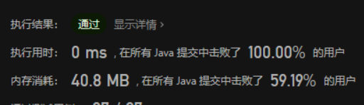
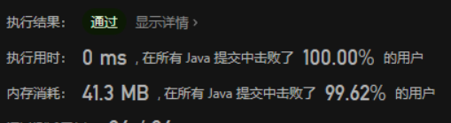

# LeetCode 剑指 Offer 反转链表 、从尾到头打印链表

# 反转链表

定义一个函数，输入一个链表的头节点，反转该链表并输出反转后链表的头节点。

**样例**
```
输入: 1->2->3->4->5->NULL
输出: 5->4->3->2->1->NULL
```

**题目链接**
[https://leetcode.cn/problems/fan-zhuan-lian-biao-lcof/](https://leetcode.cn/problems/fan-zhuan-lian-biao-lcof/)

## 解题思路
这题我的思路是用头插法，就是每次插入都是放在链表的头结点处，这样可以一边插入一边往后走，也不用维护其他的变量，非常适合这道题。

## 复杂度分析
时间复杂度：O(n)，其中 n 是链表的长度。需要遍历链表一次。
空间复杂度：O(1)。

## 代码



Java代码：

```java
class Solution {
    public ListNode reverseList(ListNode head) {
        // 这题用尾插法

        ListNode myHead = new ListNode();
        
        while (head != null) {
            ListNode node = new ListNode(head.val);
            // 别让链表断了
            node.next = myHead.next;
            myHead.next = node;
            head = head.next;
        }
        // 我这里的头结点是空的，所以返回next
        return myHead.next;
    }
}
```

# 从尾到头打印链表

输入一个链表的头节点，从尾到头反过来返回每个节点的值（用数组返回）。

**样例**
```
输入：head = [1,3,2]
输出：[2,3,1]
```

**题目链接**
[https://leetcode.cn/problems/cong-wei-dao-tou-da-yin-lian-biao-lcof/](https://leetcode.cn/problems/cong-wei-dao-tou-da-yin-lian-biao-lcof/)

## 解题思路
这题的话，我的思路是用两个数组来存，第一个数组存把链表里的数全部拿出来（顺便记个数），第二个数组就直接把第一个数组翻转过来就好了，这个思路对应我下面的代码。

另一个思路是，遍历两次链表，第一次只计数，第二次利用第一次的计数，直接实现翻转，内存占用更少，速度应该差不多。


## 代码



这速度直接无敌，Java代码：

```java
class Solution {
    public int[] reversePrint(ListNode head) {
        int[] list = new int[10000];
        int count = 0;
        while ( head != null ) {
            list[count++] = head.val;
            head = head.next;
        }
        int[] ans = new int[count];
        for (int i=0;i<count;i++) {
            ans[i] = list[count - i - 1];
        }
        return ans;
    }
}
```