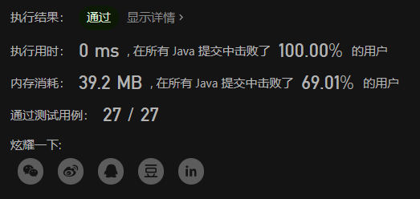
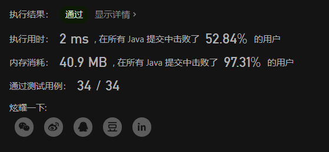

# LeetCode 剑指 Offer 替换空格、左旋转字符串

# 替换空格
请实现一个函数，把字符串 s 中的每个空格替换成"%20"。

示例 1：
输入：s = "We are happy."
输出："We%20are%20happy."


限制：
0 <= s 的长度 <= 10000

**题目链接**
https://leetcode.cn/problems/ti-huan-kong-ge-lcof

## 解题思路
这题比较简单，就是进行一个字符串替换，需要注意的是创建数组的时候，得把空间开够，因为可能出现全为空格的情况，那么需要的空间就是 3n。

## 代码

```java
class Solution {
    public String replaceSpace(String s) {
        int n = s.length();
        char[] res = new char[n * 3];
        int count = 0;
        for (int i = 0;i < n ; i++){ 
            if (s.charAt(i) == ' ') {
                res[count++] = '%';
                res[count++] = '2';
                res[count++] = '0';
            }else {
                res[count++] = s.charAt(i);
            }
        }
        return new String(res, 0 , count);
    }
}
```



# 左旋转字符串
字符串的左旋转操作是把字符串前面的若干个字符转移到字符串的尾部。请定义一个函数实现字符串左旋转操作的功能。比如，输入字符串"abcdefg"和数字2，该函数将返回左旋转两位得到的结果"cdefgab"。

示例 1：
输入: s = "abcdefg", k = 2
输出: "cdefgab"

示例 2：
输入: s = "lrloseumgh", k = 6
输出: "umghlrlose"

限制：
1 <= k < s.length <= 10000

**题目链接**
https://leetcode.cn/problems/zuo-xuan-zhuan-zi-fu-chuan-lcof

## 解题思路

这题比较简单，没什么好说的，就是进行一个字符串反转，把前面的一部分放到后面。

## 代码

```java
class Solution {
    public String reverseLeftWords(String s, int n) {
        int size = s.length();
        char[] res = new char[size + n];
        for (int i = 0; i < n ; i++) {
            res[i + size] = s.charAt(i);
        }
        for (int i = n; i < size ; i++) {
            res[i] = s.charAt(i);
        }
        return new String(res, n, size);
    }
}
```
