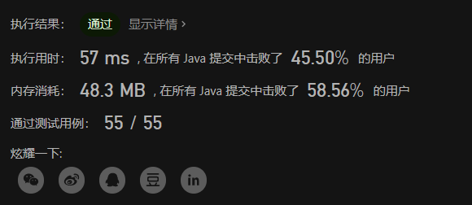
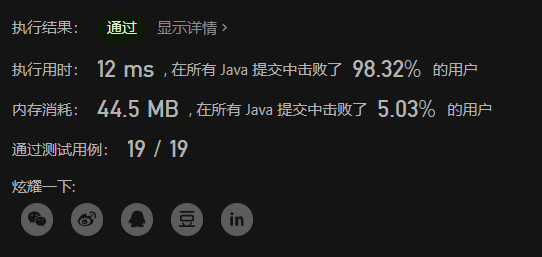

# LeetCode 剑指 Offer 用两个栈实现队列、包含min函数的栈

# 用两个栈实现队列

用两个栈实现一个队列。队列的声明如下，请实现它的两个函数 appendTail 和 deleteHead ，分别完成在队列尾部插入整数和在队列头部删除整数的功能。(若队列中没有元素，deleteHead 操作返回 -1 )

**样例**

```
输入：
["CQueue","appendTail","deleteHead","deleteHead"]
[[],[3],[],[]]
输出：[null,null,3,-1]
```

**提示**
```
1 <= values <= 10000
最多会对 appendTail、deleteHead 进行 10000 次调用
```

**题目链接**
[https://leetcode.cn/problems/yong-liang-ge-zhan-shi-xian-dui-lie-lcof/](https://leetcode.cn/problems/yong-liang-ge-zhan-shi-xian-dui-lie-lcof/)


## 解题思路
这题的话，主要是要考虑如何使用两个栈来实现一个队列的效果，能想到这个的解决方案，这题就迎刃而解了。

我的思路是，一个栈用来入队，然后另一个栈用来出队。

每当需要出队的时候，就先检查一下出队的队列里面是否有元素（刚开始肯定是没有的）：
- 如果没有的话，就把入队队列的元素全部放到出队队列中，这里是关键。我们每出队一个元素就让这个元素进入到另一个队列中，这样可以刚好把元素在栈中的顺序反过来，而且由于队列是先进先出的，所以后面插入的元素对前面的元素是不影响的。
- 如果有的话，那就直接出栈，把出栈的这个元素进行返回。

## 代码


中规中矩，Java代码：

```java
class CQueue {

    Stack<Integer> stack1 = new Stack<Integer>();
    Stack<Integer> stack2 = new Stack<Integer>();
    public CQueue() {

    }
    
    public void appendTail(int value) {
        stack1.push(value);
    }
    
    public int deleteHead() {
        if ( !stack2.empty() ) {
            return stack2.pop();
        }
        
        while( !stack1.isEmpty() ) {
            stack2.push(stack1.pop());
        }
        if (!stack2.empty()) 
            return stack2.pop();
        else 
            return -1;
    }
}

```


# 包含min函数的栈
定义栈的数据结构，请在该类型中实现一个能够得到栈的最小元素的 min 函数在该栈中，调用 min、push 及 pop 的时间复杂度都是 O(1)。

**示例:**

```
MinStack minStack = new MinStack();
minStack.push(-2);
minStack.push(0);
minStack.push(-3);
minStack.min();   --> 返回 -3.
minStack.pop();
minStack.top();      --> 返回 0.
minStack.min();   --> 返回 -2.
```

**提示：**

1. 各函数的调用总次数不超过 20000 次

**题目链接**

[https://leetcode.cn/problems/bao-han-minhan-shu-de-zhan-lcof/](https://leetcode.cn/problems/bao-han-minhan-shu-de-zhan-lcof/)


## 解题思路
- 栈的话，我们可以直接用一个数组模拟，然后用一个int类型变量进行计数。

- 先进先出嘛，进入的元素直接插入到计数器的位置就可以了，出去的元素不用管，只需要把计数器减1，因为之后会被覆盖掉的。

- 然后top函数的话，直接返回数组最上面一个元素即可。

- 最后是min函数，这里我们再用一个mini数组，用来存储当前位置的最小值，然后每次插入数据的时候，只需要比较当前这个数和上一个数即可，因为如果当前的数不小于之前的最小值，那最小值肯定就是上一个数了，感觉有点dp的思想，但是应该不难理解。


## 代码

Java代码：

```java
class MinStack {

    int mini[];
    int value[];
    int count;

    /** initialize your data structure here. */
    public MinStack() {
        mini = new int[20001];
        mini[0] = Integer.MAX_VALUE;
        value = new int[20000];
        count = 0;
    }
    
    public void push(int x) {
        value[count] = x;
        mini[count + 1] = Math.min(mini[count], x);
        count++;
    }
    
    public void pop() {
        if (count == 0){
            return;
        }
        count--;
    }
    
    public int top() {
        return value[count - 1];
    }
    
    public int min() {
        return mini[count];
    }
}

```