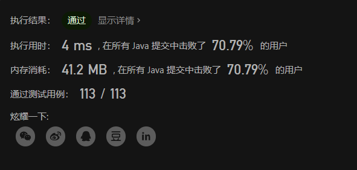
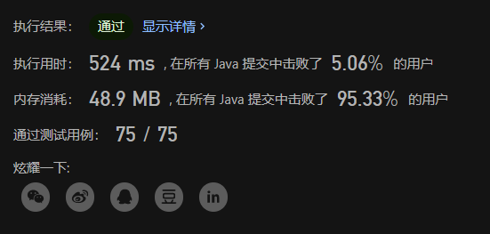

# 大疆2022秋招笔试 —— 最小时间差、数组的最小偏移量


# 前言

上周参加了大疆2022的秋招笔试，我投的是Java岗。

题目分为单选、多选和编程题，然后大疆用的是*赛码*的平台，单选15道占60分，多选5道占20分，编程题2道占20分，这里主要记录分享编程题以及解题思路。

# 编程题
两题都是原题，都能在力扣上找到。

## 最小时间差  [中等]
**题目大意**
> 给定一个 24 小时制（小时:分钟 "HH:MM"）的时间列表，找出列表中任意两个时间的最小时间差并以分钟数表示。
> \
> 示例 ：
> 输入：timePoints = ["23:59","00:00"]
> 输出：1
> \
> 提示：
> 2 <= timePoints.length <= 2 * 104
> timePoints[i] 格式为 "HH:MM"

**题目链接**
[https://leetcode.cn/problems/minimum-time-difference/](https://leetcode.cn/problems/minimum-time-difference/)

**解题思路**

这题说实话并不难。

很容易想到任意两个时间的最小时间差肯定是出现在相邻的两个时间节点中的，所以我们只需要把所有时间进行一个排序，然后再计算每两个相邻的时间差，保留最小值即可。
==需要注意的是，排序之后要把第一个时间和最后一个时间单独求一次差值，因为时间是个环嘛，超过24小时就又变为0了。==

然后上面的思路还可以进行简单的优化：因为24小时总共只有1440分钟，那么如果数组的长度超过1440，那肯定是有重复的时间节点的，那最小时间差肯定是0，直接返回即可。

**AC代码（Java）**

```java
class Solution {
    public int findMinDifference(List<String> list) {
		int n = list.size();
		if (n > 1440) {
            return 0;
        }
		int ans = Integer.MAX_VALUE;
		list.sort(String::compareTo);
		for (int i = 0; i < n - 1; i++) {
			int sub = sub(list.get(i), list.get(i + 1));
			ans = Math.min(ans, sub);
		}
		int sub = subFirstAndLast(list.get(0), list.get(n - 1));
		ans = Math.min(ans, sub);
		return ans;
    }

	public static int sub(String s1, String s2) {
		// s1 需要大于 s2
		String[] split1 = s1.split(":");
		String[] split2 = s2.split(":");
		int h = Integer.parseInt(split2[0]) - Integer.parseInt(split1[0]);
		int m = Integer.parseInt(split2[1]) - Integer.parseInt(split1[1]);
		return h * 60 + m;
	}

	public static int subFirstAndLast(String first, String last) {
		return 1440 - sub(first, last);
	}
}
```



## 数组的最小偏移量  [困难]
**题目大意**

> 给你一个由 n 个正整数组成的数组 nums 。
> 你可以对数组的任意元素执行任意次数的两类操作：
> 如果元素是 偶数 ，除以 2
> 例如，如果数组是 [1,2,3,4] ，那么你可以对最后一个元素执行此操作，使其变成 [1,2,3,2]
> 如果元素是 奇数 ，乘上 2
> 例如，如果数组是 [1,2,3,4] ，那么你可以对第一个元素执行此操作，使其变成 [2,2,3,4]
> 数组的 偏移量 是数组中任意两个元素之间的 最大差值 。
> 返回数组在执行某些操作之后可以拥有的 最小偏移量 。
> \
> 示例：
> 输入：nums = [1,2,3,4]
> 输出：1
> 解释：你可以将数组转换为 [1,2,3,2]，然后转换成 [2,2,3,2]，偏移量是 3 - 2 = 1
> \
> 提示：
> n == nums.length
> 2 <= n <= 5 * 104
> 1 <= nums[i] <= 109 	

**题目链接**
[https://leetcode.cn/problems/minimize-deviation-in-array/](https://leetcode.cn/problems/minimize-deviation-in-array/)

**解题思路**

这题有点偏，我看力扣上都没什么人讨论这题，害，还是我太菜了。思路如下：

1. 奇数乘一次会变成偶数，变成偶数之后就不能乘了，所以所有初始为奇数的数都只能乘1次
2. 偶数每次除2，那么最多只能除logN次（N为这个偶数），除到这个数为奇数为止
3. 那我们可以先把所有的奇数都变成偶数，这样它们的操作就统一了，都只能进行除2
4. 此时我们把数组排序，排序之后的最大值和最小值的差值就是当前数组的最大偏移量，但是这个值肯定不是最终的答案
5. 我们可以每次都对该数组的第一个数（即最大值）进行除2，除完之后更新答案，然后再重新排序，然后再对第一个数除2。。。
	循环操作，最终数组的最大值为奇数的时候，就可以停止循环了，因为最大值已经确定了，不能再变小了，而最小值此肯定不能再变大了，分两种情况讨论：
	
	- 此时最小值为偶数，那肯定不能变大；
	- 此时最小值为奇数，由于我们刚开始把所有奇数都变为偶数了，所以这个奇数为偶数的时候我们已经计算过了。
	
	所以循环到最大值为奇数后，答案就不会再减小了。
6. 从上面的思路可以看出，我们需要重复的进行排序，那这时候就可以使用堆来进行操作了
7. 堆排序当然不用自己实现，用优先队列（PriorityQueue）就可以了，效果是一样的，它底层就是用堆实现的


**AC代码（Java）**

```java
class Solution {
    public int minimumDeviation(int[] nums) {
		PriorityQueue<Integer> queue = new PriorityQueue<>(Comparator.reverseOrder());
		int min = Integer.MAX_VALUE;
		// 先把奇数变成偶数，并插入队列
		for (int i = 0; i < nums.length; i++) {
			if ((nums[i] & 1) == 1) {
				nums[i] <<= 1;
			}
			min = Math.min(min, nums[i]);
			queue.add(nums[i]);
		}
		// 每次取堆顶元素进行操作，直到元素为奇数
		int ans = Integer.MAX_VALUE;
		int top;
		for (top = queue.poll(); (top & 1) != 1; top = queue.poll()) {
			// 每次更新答案
			ans = Math.min(ans, top - min);
			queue.add(top >>= 1);
			// 最小值需要更新
			min = Math.min(top, min);
		}
		// 最后为奇数时需要重新判断一次
		return Math.min(ans, top - min);
    }
}
```
有点慢哈哈哈🤣🤣🤣




# 后记
有兴趣的同学可以自己去力扣上做一下这两题，感受一下大疆的笔试难度，我当时第二题是没有写出来的，后面复盘的时候找到原题再重新去写出来的。

大疆给的笔试时间是一个小时，前面单选和多选题我做了15分钟左右，那这两题的时间就是45分钟，大家可以去试试，给自己45分钟时间看能不能通过这两题🤪🤪🤪。