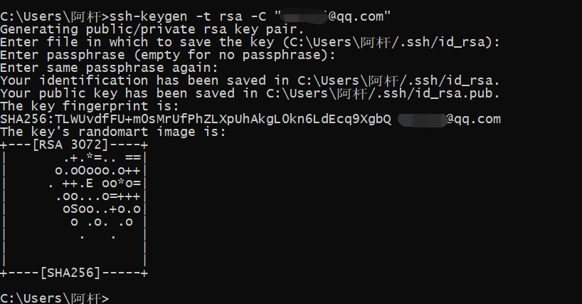
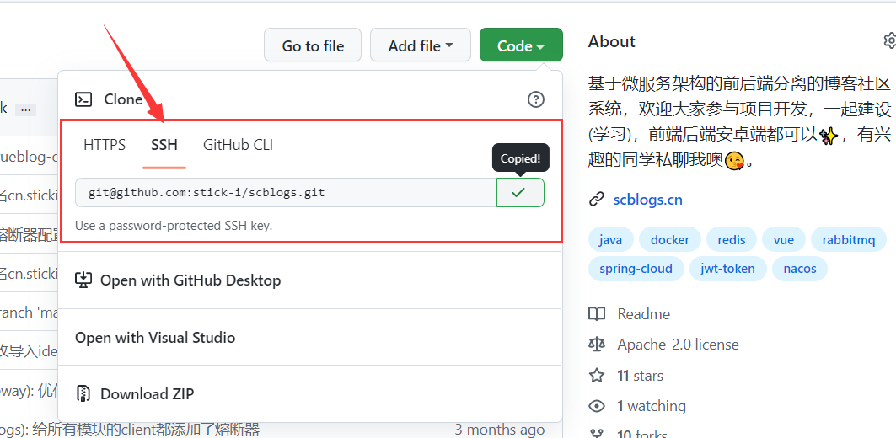

# 都什么年代了！你居然还连不上GitHub？

# 前言

众所周知，GitHub是我们程序员在上班或者学习的时候经常会逛的一个地方[手动狗头]，而且如果我们想参与开源项目的话，GitHub也是一个很好的平台。

可问题是，GitHub网页总是进不去，提交代码到GitHub也总是超时，简直烦死😭😭。


有时候我们在Gitee上看到一个好的开源项目想要参加，但是别人可能只是从GitHub同步到Gitee的，Gitee上的社区完全没人交流，那这种情况下，想参与项目贡献还是得去GitHub才行😖🤐。

为什么我们访问GitHub这么慢呢？引用网上的解释：

> GitHub的CDN域名遭到DNS污染，无法使用GitHub的加速分发服务器，而它的服务器又是在国外，所以国内的访问速度就会很慢。

那有聪明的朋友就要说了：“我有梯子我不怕，访问速度快得很”，那没有梯子的朋友该怎么办呢？

==如果你也有这些烦恼，那很高兴你能看到这篇文章，因为它或许能够帮你解决这些问题，至少让你能基本使用GitHub🧐。==


# 要解决的问题

我们要解决的问题，无非就是两个：

1. 使用git bash操作GitHub远程仓库，比如拉取代码、提交代码等。
2. 访问GitHub网页版。

下面我会分别就这两个问题给出解决方案，并附上操作教程。

# 一、操作远程仓库解决方案

大多数同学可能是使用的http协议创建的远程连接，就是当我们创建远程仓库的时候，使用的是下图里HTTPS的链接，==但其实很多人不知道，用SSH协议操作GitHub仓库其实是很流畅的==：


如果不确定自己是否使用的HTTP协议还是SSH协议，可以通过指令`git remote -v show`来查看：


像我这里同时添加了两个远程仓库，一个是GitHub（用的SSH协议），另一个是Gitee（用的HTTP协议）。

---

用HTTP协议连接GitHub远程仓库不行吗？

如果是对于国内的Gitee或者自己公司的Git仓库，那我们用HTTP协议作为远程仓库都是可以正常访问的。

**但对于GitHub来说，那就不行了**。那会让你感觉到什么叫写了代码却提交不上🤣，反复重试也只是不断超时，运气好的时候才能正常操作。

**所以我们要使用SSH协议来作为GitHub远程仓库的链接**。这样就会很流畅了，非常的流畅，跟用Gitee一样流畅🤣🤣。

下面给大家介绍一下SSH的配置方式，学会了就可以自己去配置啦！

## 配置SSH

SSH是通过公钥密钥的方式来验证身份的，密钥放在自己电脑上，公钥存到平台上，所以我们配置好之后，就不再需要使用账号密码登录了。而且你在本机生成好密钥之后，可以在多个平台使用，你只需要把公钥存放在多个平台就好了，他们可以通过密钥识别你的身份。

> 其实配置SSH的教程网上有很多，如果大家看我下面的教程还没明白，可以上百度再搜一些其他的教程学习

### 1. 检查是否存在sshkey

在`C:\Users\用户名\.ssh`文件夹下可以看到当前电脑的sshkey。

如果有 id_rsa 和 id_rsa.pub 两个文件，就说明已经存在了，可以跳过生成密钥对的步骤，如果找不到目录或者没有这两个文件，则需要先生成。我这里是已经有了的，为了给你们演示，我先把他们删掉😎。


### 2. 生成密钥对

在 **cmd控制台** 上使用如下命令来生成 sshkey：

```sh
ssh-keygen -t rsa -C "xxxxx@xxxxx.com"
```

> 注意：这里的 `xxxxx@xxxxx.com` 只是生成的 sshkey 的名称，并不约束或要求具体命名为某个邮箱。
> 网上的大部分教程均讲解的使用邮箱生成，其一开始的初衷仅仅是为了便于辨识所以使用了邮箱。

输入上面的指令并回车后会弹出一些提示：

1. 第一次提示保存路径，一般不需要修改，直接回车就行

2. 第二次提示输入密码短语（等于是sshkey的密码），可以有也可以没有（建议还是设置一下），注意输入密码的时候是不会回显的，这里假设我设置的是 *123456*
3. 第三次是重复输入密码




完成三次操作后就生成完毕了，这时候再到.ssh的文件下面去看，能看到你的id_rsa 和 id_rsa.pub 两个文件，就说明你已经生成成功了。

**注意这个 id_rsa.pub 是公钥，将来要放到GitHub上的，另一个id_rsa是私钥，等于是你的密码，保存好，不要随便发给别人。**

### 3. 把公钥放到GitHub上

打开GitHub（打不开咋办？那先看下面的访问GitHub网页教程🤣🤣🤣）

1. 点击头像 -> settings：

   

2. 点击左边 SSH and GPGkeys，再点击右边 New SSH key：

   

3. 写个标题（可以随便写，但建议写主机名），然后把刚刚生成的 id_rsa.pub 里面的内容复制过来，粘贴在下面的 key 那个框里（对没错，直接ctrl A全选复制就行）：

   

4. 最后点击 Add SSH key，系统会让你输入GitHub账号的密码，然后就添加完成啦！

### 4. 测试

我们用刚配置的sshkey拉取一下GitHub上的项目代码试试。

1. 直接去项目里复制一下ssh的链接：

   

2.  然后到本机找个文件夹打开 Git Bash，输入 git clone 指令：

   

3. 这时候会让你输入密码短语，这个就是我们前面生成密钥的时候设置的东西，我设置的是 *123456* ，那么输入密码，回车，就可以看到项目被成功拉取啦！这个密码只有第一次拉取项目的时候会让你输入，后面再进行别的操作就不需要弄了。

   


至此，我们的SSH就配置完成啦！学会的朋友可以去试试了，保证你的 clone、pull、push 等操作将会非常流畅🤣🤣


# 二、访问GitHub网页解决方案

这个的话，主要是借助于第三方工具 FastGitHub来访问的。

FastGitHub是一个免费的、开源的、仅用于加速GitHub的工具，作者是 @dotnetcore，它的基本介绍如下：


注意：它能且仅能用于GitHub加速，并不具备梯子的功能，主要是通过ip解析和测速来帮助用户选择最快的访问ip，来达到加速访问的效果。

## 下载FastGitHub

下载方式：

1. 在项目的Releases上进行下载（下载最新版即可）：https://github.com/dotnetcore/FastGithub/releases
2. 发送任意邮件到 fastgithub@qq.com

访问不了GitHub的同学直接发邮件过去就好啦！


## 启动服务

我下载的Windows版的，下载解压之后会有这样一堆东西：


可以直接参考README文档，里面的简单的教程。一般的使用方式是双击打开 FastGithub.UI.exe ，会看到如下界面，然后就可以去GitHub ~~玩耍~~ 学习啦🤣🤣！


启动了FastGitHub服务之后，访问GitHub网页仍然会出现一些卡顿的现象，但是基本可以保持正常使用的状态。访问起来偶尔也会有点卡，但至少能正常使用😎。


## 注意

需要注意的是，FastGitHub会通过创建CA证书的方式来建立有效连接，这在某些场合下会出现一些 “是否信任xxx证书” 的提示，比如idea：


由于我们配置了SSH协议的远程仓库，所以即使不使用FastGitHub我们也可以正常操作，那这种情况下我们点拒绝就可以了，如果是没配置SSH协议的朋友，那点接受，可以让你通过FastGitHub来建立远程仓库的连接。

如果觉得在idea里总是弹这个提示很烦人的话，可以去设置里面搜索证书，找到服务器证书的选项，并且勾选自动接受非可信证书的选项，就不会再提醒啦！（是不是很贴心😎）


# 后记

本篇文章讲解了如何流畅的访问GitHub，给出的解决方案是通过配置SSH密钥和使用FastGitHub软件，并且给出了比较详细的教程，如果文章中有任何错误的地方，欢迎各位在评论区指正🥰。

---

最后，欢迎各位参与我的开源项目**校园博客**😋，可以试着使用上面教大家的方法来访问项目地址🤣。

- GitHub地址：[https://github.com/stick-i/scblogs](https://github.com/stick-i/scblogs)

>项目的技术栈主要是：
>\
>后端 Java + SpringBoot + SpringCloud + Nacos + Getaway + Fegin + MybatisPlus + MySQL + Redis + ES + RabbitMQ + Minio + 七牛云OSS + Jenkins + Docker
>\
>前端 Vue2 + ElementUI + Axios

==目前项目还有很大改进和完善的空间，欢迎各位有意愿的同学参与项目贡献==（尤其前端），一起学习一起进步😋。

