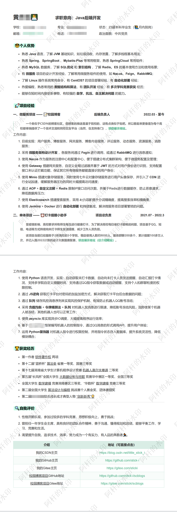
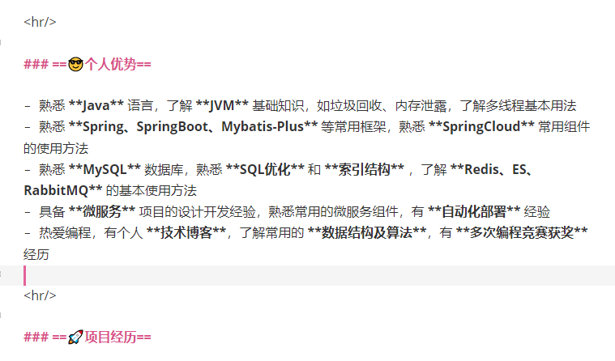
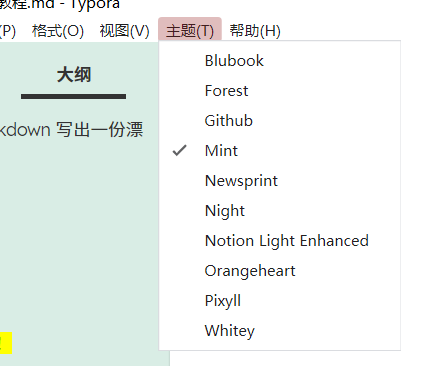
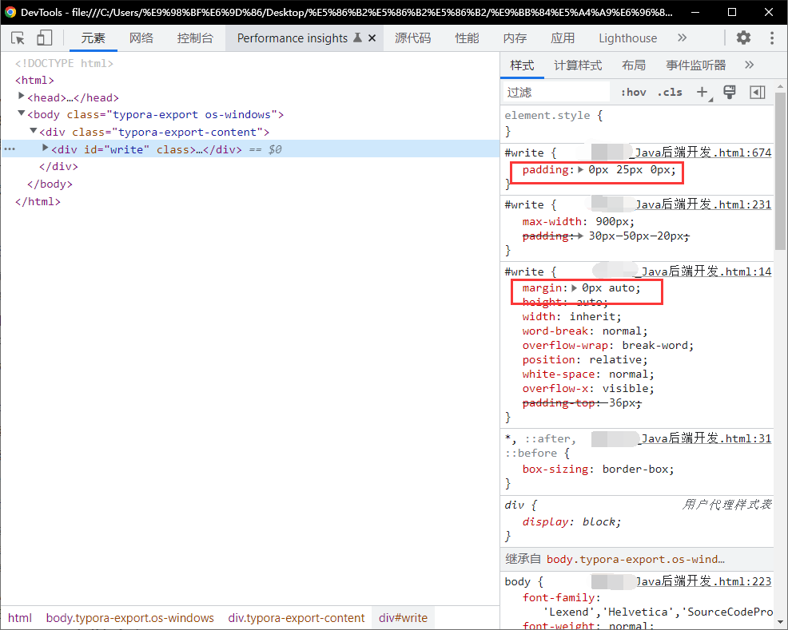

# 关于如何使用 Markdown 写出一份漂亮的简历

# 前言

一份漂亮的简历，能让HR和面试官看起来更舒服一点，给我们增加通过简历的机会。

> 先讲讲我的经历：
>
> 想做一份漂亮但又简洁的简历（毕竟学计算机的嘛，简洁一点看着舒服哈哈哈），于是去找简历模板，看了很多很多，感觉还行，但是又感觉不太行，因为自己要写的内容太多了，这种一页简历不太好扩容，也不是很好看🤐。
>
> 于是去看周围的同学，看他们好多用超级简历做的，确实简洁，非常的简洁。但是进去刚做完一份简历，卧槽要付费！到网上找了个三天的VIP兑换码，导出成功，不愧是我😏。过了几天，想改改简历，卧槽会员过期了。。。😅
>
> tnnd，看来还是有个模版才行啊，这种线上的东西，总感觉不是自己的，于是到淘宝花1.99买了个简历套餐，直接拿到一万多份简历模块😋，看了几十份，好像都不怎么样，而且还有些排版都不整齐的，直接给我整破防了😭。
>
> 想做个好看的简历怎么就这么难啊😖。

我最终想到了用Markdown文档写简历，因为它标准的排版，简洁的格式，以及贴合程序员的审美，都让我觉得这是一个很好的选择！

如果你有跟我相似的经历，那太好了，这篇文章能解救你于水深火热当中，别忘了给我点赞收藏关注呀😁。


# 简历展示

==废话不多说，先上两个成品简历给大家看看==

## 一页简历展示


## 两页简历展示



## ==咋样？还不错吧！==

上面这两份简历其实核心内容是差不多的，那个一页的简历就是由两页简历删减之后压缩来的，所以看起来有点挤，但是也还能接受，而且内容很足。如果有面试官和HR刚好看到我的文章，欢迎对我的简历做出评价，也欢迎其他同学进行评价，我会根据你们的评价进行修改和完善，感激不尽🧐

我研究了好几天的简历制作方法，各位记得点赞收藏呀😜如果有需求的话，后期可能会做个视频手把手讲解一下。


# 教程开始

首先说明一点，这个简历没有固定模板，它本身也不是什么模板，其实它就是一个普通的md文档，加一个好看的主题，再外加一点CSS调整，然后导出来就这样了。所以这份简历的关键，其实就在于你的内容，和CSS的调整，不过这个调整肯定是根据你自己的内容和喜好来进行的，所以恕我不能直接提供模板👴，需要各位自己动手做才行，但是我会贴一些我的css给大家。

对了，需要一点前置知识，==必须要会写md文档==（这个其实很简单，学一个小时就会了😅），然后==最好会一点css和html的知识==，因为后面要进行微调🎈。

## 第一步：下载安装Typora

很多同学都已经有在用这个软件了，可以跳过这一步。

这是一个本地的md文档编辑器，支持所有md语法，然后还支持更换多种主题。

Typora官网：https://typoraio.cn/

Markdown手册：https://support.typoraio.cn/zh/Markdown-Reference/

正版需要付费89元，有15天体验期，然后不想付费又想永久使用的同学可以去网上找其他方法，我本人是付费了的，因为这个软件我经常用，所以购买正版支持作者🍔。

**安装好之后不会用的同学看这里：**

首先在桌面建一个文本文档，改名为 `我的简历.md`，注意要把后缀名改成md，然后右键该文件选择打开方式->选择其他应用，找到刚刚下载的typora，然后打开，然后在里面写内容就可以了。

typora写出来的md文档直接是样式预览的，如果你想看md代码的形式的话，可以按`ctrl + /` 切换模式，不会写md的同学可能要先去学一下md的写法（应该不会有人不会吧🤯）。


## 第二步：写内容

很简单，就是你用这个软件去写一份自己的md文档简历就行了，平时怎么写md的就怎么写简历，不过要稍微注意一些排版和格式的运用。

说明：md文档是支持内嵌html和css的，会用的同学可以直接内嵌使用，不会的先不管。

给大家列出几个关键点：

- 不同的模块可以用多级标题隔开，比如我的简历分为 个人优势、项目经历、获奖经历、个人评价，那我就给这几个模块的设置为三级标题（这个具体几级看你们自己的喜好），然后还可以用横线来多加一层隔离，横线的格式是 `------` 或者 `<hr/>`

- 重点部分进行加粗或者高亮 ，`==高亮内容==` `**加粗内容**`

  > 如果使用“==”来标记高亮没有效果的话，需要在 <u>偏好设置->Markdown->扩展语法->高亮</u> 中打开此功能，如下图：
  >
  > 

- 多使用列表，有序列表和无序列表都可以

  

- 展示地址可以用超链接来表示，这样后期可以在导出的pdf上直接点击跳转，比如这样`[项目开源地址](https://gitee.com/sticki/scblogs)`，可以把个人GitHub地址或者项目演示地址等等这样的连接放上去

  

- 适当利用表格，比如获奖经历

- 适当利用引用，就是 `>` 那个样式，用来介绍项目就挺好的。

- 有打空格的地方，不能用普通的空格，因为到时候导出HTML微调的时候会被忽略掉，如果需要加空格调整格式的话，请使用`&nbsp;` 或者 `&thinsp;`，具体请参考：https://wenku.baidu.com/view/2505a398950590c69ec3d5bbfd0a79563c1ed41c.html

- 需要左右对齐拉满的地方，比如项目名称、项目职责、项目时间这里，我是都放在同一行的，那么就需要来个内嵌HTML保证他们占满整行，这里我用的h4，你们可以根据自己的修改，别改里面的style就可以了：

  ```html
  <h4 style="display: flex;justify-content: space-between;">
  <span>一、微服务项目 —— 📝校园博客</span><span>后端负责人</span><span>2022.03 - 至今</span>
  </h4>
  ```

  样式展示：

  

- 至于头像怎么贴上去，我直接把我个人信息部分的md代码贴给大家参考，效果参考一页简历的展示图，里面的宽高大家可以自行调整，文件路径改成自己的路径。

  ```md
    # 姓名👨‍💻&emsp;&emsp;&emsp;<strong><span style="font-size: 18px">求职意向：Java后端开发</span></strong>
    
    学校：XXXX &emsp;&emsp;&emsp;&emsp;&emsp;&emsp;&emsp;&thinsp;专业：XXXXXX&emsp;&emsp;&emsp;&emsp;成绩：前5%
    
    邮箱：xxxxxx@qq.com &#09;&#09;&#09;&#09;&#09; 电话：xxxxxxxxxxx&emsp;&emsp;&emsp;&emsp;状态：23届本科毕业生
    
    [我的CSDN博客主页](https://blog.csdn.net/little_stick_i?type=blog)&emsp;&emsp;&emsp;&emsp;&emsp;&thinsp;[我的GitHub主页](https://github.com/stick-i)&emsp;&emsp;&emsp;&emsp;&emsp;&emsp;[我的Gitee主页](https://gitee.com/sticki)
  ```

- 其他部分也可以参考我的简历样式，上面的两张展示图的内容可以随便参考，照着我的样式来写也可以的。

- 聪明的同学肯定会问我这些图标好看的图标哪来的🤠，确实，如果少了这些图标真没那么好看了。这些图标是来自windows10系统自带的，按快捷键 `win + 。`会弹出图标选择界面，里面很多图标，随便选，想怎么用就怎么用😝

  


## 第三步：选主题

内容写好了，接下来改选一个自己喜欢的主题了😋

我上面贴的简历就是用的它里面的一个主题，其实这些主题都是css描绘出来的，会css的同学也可以自己做个主题，这里我就不展开讲了，有兴趣的同学参考这篇文章：https://blog.csdn.net/weixin_44911685/article/details/119449641。

可以看到菜单栏上面有个主题的选项，这里有一些自带的主题（默认的没有这么多，我自己安装了几个新的），你可以先把里面的所有主题都切换一遍，看看有没有自己的喜欢的，如果有那就OK啦，可以跳过这一步了，如果没有就接着往下看。



那么我们现在要去下载一些在线主题过来，进入下面的主题下载地址（**可能需要翻墙**），里面有很多不同的主题，挑自己喜欢的下就行了，可以多下几个，到软件里试试好不好看🛴。

主题下载地址：https://theme.typora.io/

主题安装教程：https://blog.csdn.net/weixin_44911685/article/details/119449852

这里我推荐几个主题，**我自己用的是Mint**，就是上面展示的那个样子，挺好看的，然后还有一个OrangeHeart（橙心）也挺好看的，还有Forest（森林）也不错哈哈哈。

安装好主题之后，==可以试试当前主题不同级别的标题，可能样式会不一样==，没准会带来惊喜，然后试试高亮 `==` 的样式，还有各种其他的样式。如果确定好一个主题了，就根据当前主题对自己的简历进行一些调整，比如标题级别，高亮还是加粗，要不要用表格等等。


## 第四步：微调

### 导出为HTML

微调其实是针对HTML和CSS进行微调，因为这两者的组合可以达到最大的自由度，让我们有足够的调整空间。

首先导出为HTML，在==文件->导出->HTML==，别问我为什么不直接导出PDF，我只能说不好看😢。


然后会获得一个HTML文件，在浏览器中打开，最好用谷歌浏览器，因为edge最后导出的时候会变成图片，链接会失效。

### 预览PDF

这时我们已经可以在浏览器的页面中看到简历的样子了，注意此时链接什么的应该都是可以点击的，检查一下链接指向的网站对不对。

然后按 `ctrl  + p`，会弹出打印界面，像这样的：


可以把这个当做是预览，因为我们最终导出的PDF就和你现在预览的是一样的，==不过预览界面里面的链接是不能点的==。

当然，此时预览的结果肯定是不满意的对吧！那必不可能满意啊，不然还微调干嘛🤣🤣

### 开始微调

首先根据你自己的想法：你是想做成两页还是一页？你是想挤一点还是想宽松一点？根据这些来调整行间距，可以把整体拉的宽松或者拉挤，怎么调？

F12会用不，F12一开，用元素选择器，选择你想调的部分，然后去调整这个部分的css代码，比如padding、margin这些的，就是调整间距的，自己看着调，感觉差不多了就`ctrl + p`去预览一下，可以调整体的，也可以调一下细节上的，总之这个部分根据自己的情况来调就好了，一般把自己的内容填充满一页或者两页就差不多了🤗。



调完间距，中间还有些东西是可以删除的，比如表格上面那个表头，在md文档里面是删不掉的，但是HTML里面肯定是可以删的，也一样用元素选择器去删掉就好了。

还有其他的样式大家都可以**根据自己的内容去进行调整**，其实这个部分调的最多的还是间距上的，像我做那个一页简历的时候，调了多级标题间距、列表间距、表格间距、分割线间距等各种间距。

然后还有个小技巧，就是调完之后的HTML记得保存一下，不然等会一刷新就直接无了。

或者可以==把修改过的css复制到md简历文档的最后面==，这样的话，在md文档导出为HTML的时候，就会自动识别这些css，并且覆盖原来主题的css，就可以不用再重新调整了，像这样（推荐）：


调整的过程中多预览，调成自己最满意的样子。

-----

这里贴上我加在md后面的css，然后你们再做一些相应的调整就好了：

- 一页简历的CSS

```html
<style>
    #write {
        padding: 0px 25px 0px;
    }
    hr {
        margin: 2px;
    }
    li {
        margin: 5px;
    }
    p {
        margin: 4px 15px;
    }
    h1 {
        margin: 6px 15px;
    }
    h3 {
        margin: 9px;
    }
    h4 {
        margin: 7px;
    }
    figure {
        margin: 7px 0px;
    }
    table td {
        padding: 4px 13px;
    }
    blockquote {
        padding-left: 16px;
    }
</style>
```

- 两页简历的CSS

```html
<style>
    #write {
        padding: 15px 30px 20px;
    }
    hr {
        margin: 1rem 0;
    }
    li {
        margin: 8px;
    }
</style>
```


## 第五步：导出，大功告成！

微调搞定了，预览得到的样子也很满意了，那就可以导出成PDF了，就是 `ctrl + p` 然后点击保存，==最好用谷歌浏览器==，不然出了问题我不管的啊🤣

然后就打开刚刚导出的PDF，去看看OK不，OK的话就大功告成啦，恭喜你达成成就：使用Markdown文档制作一份精美的简历！


# 后记

觉得有帮助的同学可以点赞收藏关注支持一下，我一个字一个字敲的😥，花了好多时间呐🤧

希望大家都能做出满意的简历😁

------

最后的最后，悄悄的推广一下我的开源项目😋：

- Gitee地址：[https://gitee.com/sticki/scblogs](https://gitee.com/sticki/scblogs)
- GitHub地址：[https://github.com/stick-i/scblogs](https://github.com/stick-i/scblogs)

项目的技术栈主要是：

后端 Java + SpringBoot + SpringCloud + MybatisPlus + MySQL + Nacos + Getaway + Redis + ES + RabbitMQ + Minio + 七牛云OSS

前端 Vue + ElementUI + Axios

自动化 Jenkins + Docker

前端后端开发者都欢迎加入，也欢迎正在学习相关技术然后想要练手的同学加入🥰🥰！


