# Postman 中级使用教程，你真的会用Postman吗？【环境变量、测试脚本、断言、接口文档等】

Postman环境变量、测试脚本、断言、接口文档等工具你听说过吗？快来看看这篇Postman中级使用教程吧！没准能给你开启一片新大陆！


首先介绍一个转中文版的方式，GitHub链接：[https://github.com/hlmd/Postman-cn](https://github.com/hlmd/Postman-cn)

@[TOC](目录)

## 全局变量和环境变量

### 新建环境变量

定义好的全局变量和环境变量，可以在接口中进行引用。

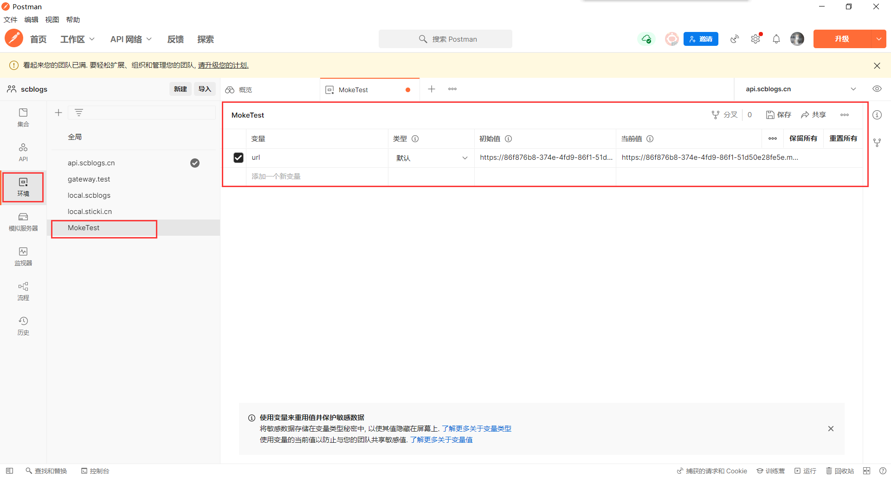


1. 新增环境时你可以点击左上角那个加号，然后在环境中添加你要用到的公共变量。

   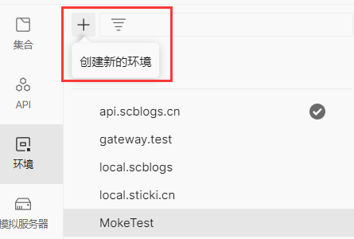

   

2. 这个功能一般用于像 `url前缀` 这种很多地方都会重复使用的变量。引用方法为两个花括号中间放你要引用的变量，例如：{{url}}，就像这样：

   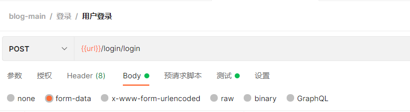

   

3. 当然如果你需要在多个环境下进行切换的话，也不需要总是去修改 url 的值，你可以多建几个环境变量，然后在右上角进行快速切换：

   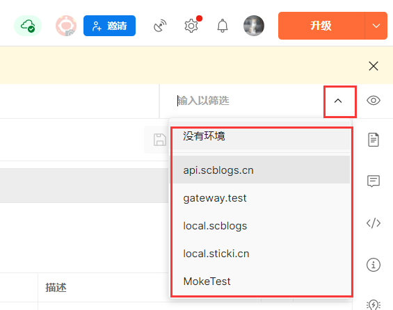

   

4. 点击小眼睛可以看到你当前正在使用的环境中有哪些变量：

   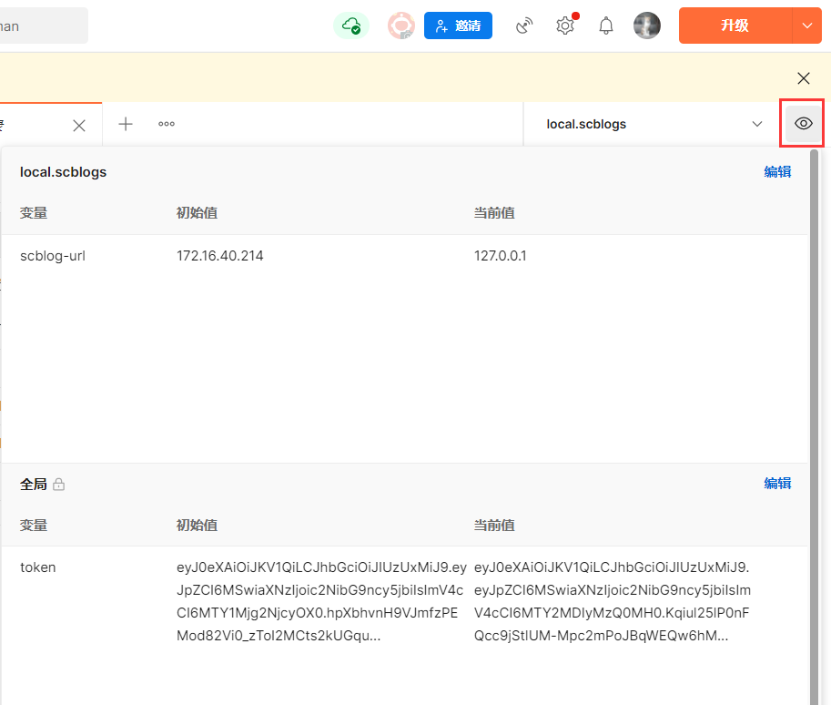

   

## 接口关联

实际上也是利用全局变量

### 编写测试脚本

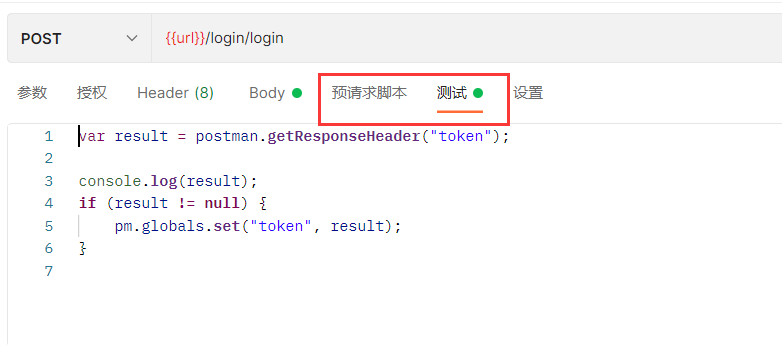
==预请求脚本和测试脚本都可以写js代码，他们的区别是，预请求脚本是在发送请求之前运行的，而测试脚本是在发送完毕后运行的。==


在测试脚本中获取数据并设置为全局变量，例如登录时得到的token：

```js
var result = postman.getResponseHeader("token");

console.log(result);

pm.globals.set("token", result);
```

这样设置得到的全局变量token就可以被用于其他接口上，使用 `{{token}}` 来引用变量。

当然，也可以使用正则表达式来获取变量，就跟用js写正则一样，这里不过多介绍。


## 动态参数

### 内置动态参数

- {{$timestamp}}  生成当前时间的时间戳
- {{$randomint}}  生成0-1000之间随机数
- {{$guid}} 生成速记GUID字符串


### 自定义动态参数

在预请求脚本中通过js代码来设置变量，使用时使用 {{times}} 来获取变量，和接口关联中编写的测试脚本差不多。

```js
var times = Date.now();

pm.globals.set("times", times);
```

### 获取全局变量的方式：

```js
pm.globals.get("token", result);
global["token"];
global.token;
```


## 断言

可以使用断言来判断请求是否成功，用做自动化测试。

postman支持多种断言方式，在测试脚本的右侧可以看到，点击蓝色的字可以直接获取到代码：

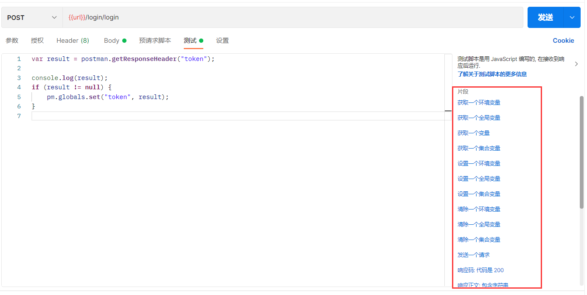


下面列举几条常用的：

```js
pm.test("Status code is 200", function () {
	pm.response.to.have.status(200);
});
pm.test("Body matches string", function () {
	pm.expect(pm.response.text()).to.include("string_you_want_to_search");
});
pm.test("Your test name", function () {
	var jsonData = pm.response.json();
	pm.expect(jsonData.value).to.eql(100);
});
pm.test("Body is correct", function () {
	pm.response.to.have.body("response_body_string");
});
```

## MokeService

创建模拟服务器。在后端接口还没有开发完毕之前，前端想要调用接口，可以先使用postman提供的模拟服务器功能。

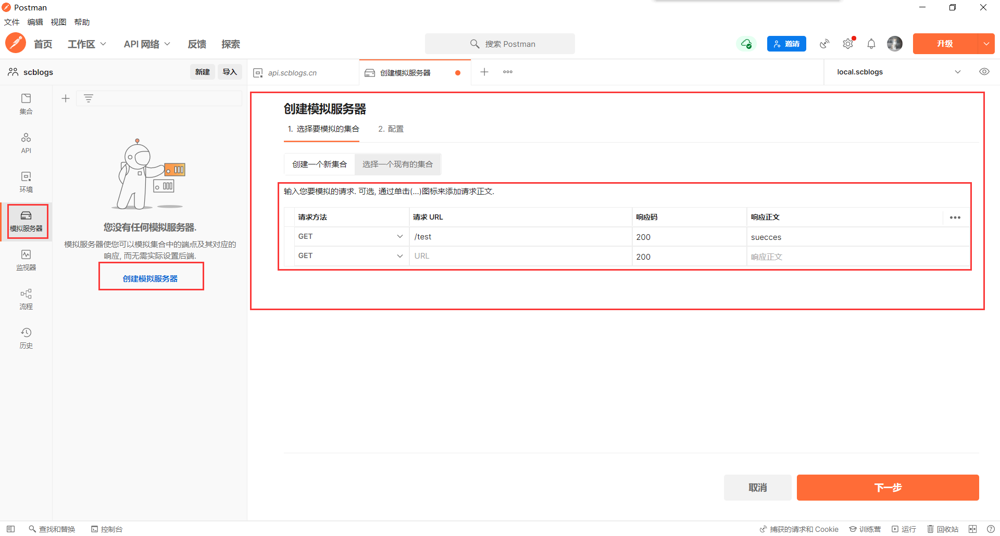


创建一个模拟服务器，只需要设置请求名，postman会自动生成一个url提供给你临时使用，该url可以直接使用外网进行访问，但返回的数据是固定的，不过给前端临时使用是足够的。


## 编写接口文档

在每个接口的右侧都有一个文档的按钮，点击即可对当前接口编辑说明：

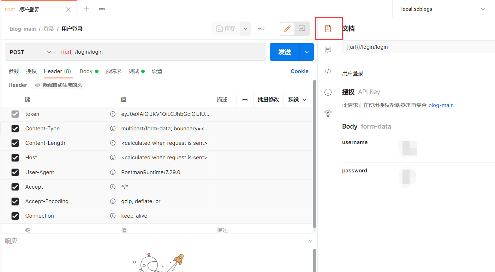

测试的接口和编写好的文档可以直接生成文档，在集合的选项里可以查看到：

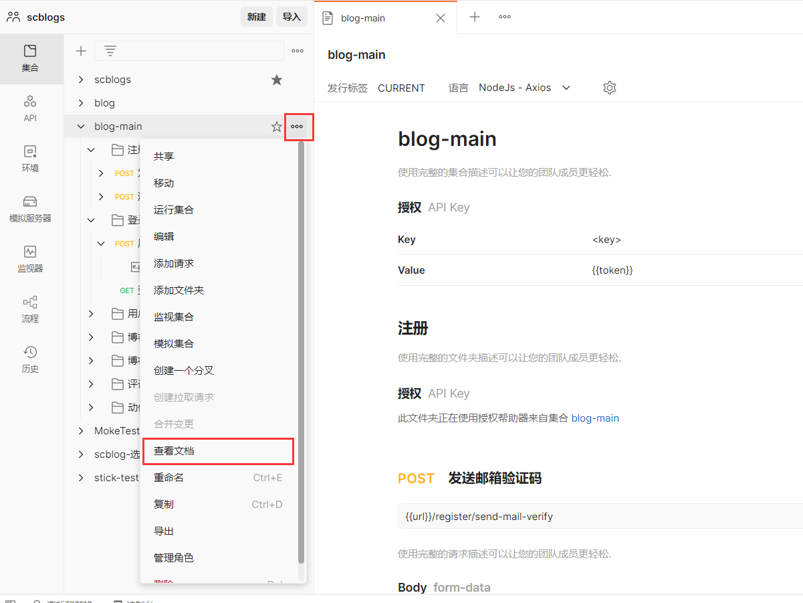

然后文档的右上角有一个发布的按钮，点击发布好像可以生成在线文档，但是我还没有用过。


## 保存测试示例

发送完成的请求，可以将请求结果保存起来，提供给其他人参考。保存好了示例会显示在左侧集合中，被放在该接口下。

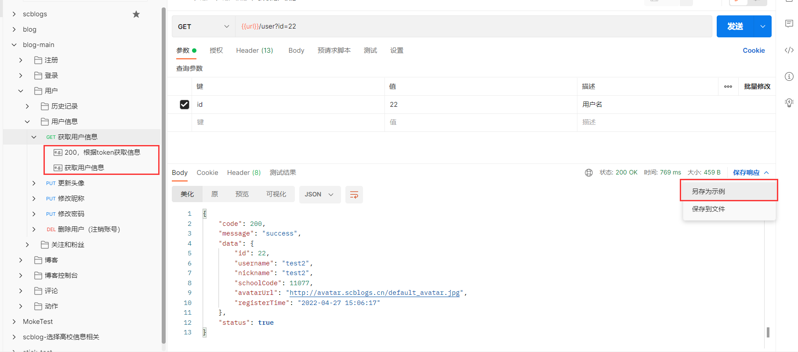


## 后记

看完这些功能，你还觉得你会用Postman吗？🤣🤣

麻烦大家把自己会用的功能的个数打在评论区，每个大块算一个，一共有7个。咱们就是说，看看大家都会几个功能🧐。

