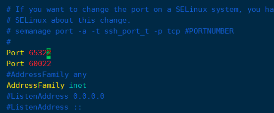

# 记一次云服务器被密码爆破的经历 — 关小黑屋、改密码、改端口

@[TOC]


当我登录时看到这条警告，我意识到我的服务器可能正在被爆破


## 检查登录情况

于是我马上通过指令 `lastb` 查询了登录失败的记录，输出结果令我大为震惊，大概刷新了五六秒？可能更多，登录记录显示，从本月的1号开始，到现在我写这篇博客，整整一个月，都一直有人在尝试登陆我的服务器。。。


这些ip都是来自国外的，且攻击者目前还在尝试爆破，说明他可能还没有登录成功，于是我输入last指令，查看登录成功的ip：


然后我把这些ip都查询了一遍，没有发现异常ip（这里都是我的ip，我就打码了）。

到这，我暂时可以确定，攻击者还没有登录上我的服务器，那就不着急了，下面开始处理，顺便做一下记录。

## 关小黑屋
首先我们可以把当前这些确定的ip进行小黑屋处理。

我使用的是腾讯云的服务器（用阿里云的操作也差不多），马上登腾讯云后台去看了一下，发现并没有检测到异常，这里的异常登录也都是我自己的。


在密码破解这块直接是什么都没检测到，不知道是不是由于我修改了ssh端口的原因。。。


### 查询当前正在爆破的ip
首先通过 `lastb -n 10` 来查询最近10条登录失败的记录：


那么可以直接在登录端口上对该ip进行黑名单处理。

 添加一条防火墙规则，启用限制来源，地址为需要被拉黑的地址，然后策略为拒绝，端口号为登录的端口号（默认为22，我是自己修改到了60022的）。点击确定。


稍微等待几分钟，然后再去查询登录记录，发现该ip的登录记录停止了（当前时间为17:04，停止了3分钟)。


## 新的问题及解决思路
那么眼下当前的登录爆破是被挡住了，但是攻击者很显然不止这一个ip，因为之前的登录记录中就有出现多个ip了，那我总不能它换一个我加一个吧。。。

说时迟那时快，刚写完上面那几个字，再查一查登录记录，果然换了个ip又来了。。。 哥们你可真刑啊。。。


这个ip也是国外的，之前尝试登陆的几个ip也都是国外的，那这样的话，我直接把国外的ip全给限制了不就好了吗？然后我果断去百度查了一下国内的ip地址范围，妈呀，这有点多呀，而且还很乱。


换个思路想，其实远程登录这个东西，我只需要给自己可能会用到的少数几个ip用就可以了，那这样的话，我可以直接限制成只有我所使用的ip允许访问就好了呀。

于是去查一下自己的ip：


把这个ip设计为允许远程登录端口访问的ip，==并删除其他的远程登录端口的规则==：


## 加强安全性
尽管上面的操作基本就可以保证其他人无法再尝试爆破登录了，但我还是不太放心，所以我还是想要做一些其他的措施。

### 修改密码

修改密码这是最简单的了，输入指令 `passwd` ，默认就是修改当前用户的密码，如果输入 `passwd tom`，则是修改tom用户的密码。


需要注意的是，在你输入密码的时候，它是不会显示任何字符的，连 `*` 都不会显示，新手很容易以为是没有输入进去，其实并不是的。输入两次后即可更改成功，建议密码改难一点，然后自己记在一个靠谱的地方。

### 修改端口号

其实修改端口号应该是没有修改密码更有效的，因为端口号总共也就只有 2^16^ 个，而密码理论上可以有20^62^种可能（20位的密码，a-zA-Z0-9，一共62个字符），所以复杂的密码更能有效抵挡攻击。

但是为了保险起见，所以我还是改一下端口号。

1. 修改SSH配置文件（注意是sshd_config而不是ssh_config，多了个d）
	```sh
	vim /etc/ssh/sshd_config
	```
	找到“#Port 22”，这一行直接键入“yyp”复制该行到下一行，然后把两行的“#”号注释去掉，修改成：

	Port 22 （这里是原来的端口号，没有修改过的话就是22，我的之前改过了，所以是60022）
	Port 65322 （这里写一个自己意向的端口号）

	SSH默认监听端口是22，如果你不强制说明别的端口，”Port 22”注不注释都是开放22访问端口。上面我保留了22端口，防止之后因为各种权限和配置问题，导致连22端口都不能访问了，那就尴尬了。等一切都ok了，再关闭22端口。
	

2. 到防火墙开启新端口
	```sh
	firewall-cmd --zone=public --add-port=65322/tcp --permanent
	```
	命令含义：  
	--zone #作用域   
	--add-port=65322/tcp #添加端口，格式为：端口/通讯协议   
	--permanent #永久生效，没有此参数重启后失效

3. 重启SSH服务和防火墙
	```sh
	systemctl restart sshd
	systemctl restart firewalld.service
	```

4. 到腾讯云控制面板的防火墙开启新端口
如果是使用的云服务器，那么服务商还会在linux主机内装一个管理软件，这个软件同样具有防火墙的功能，我们之前加小黑屋就是用的它的防火墙，所以这里登录端口也要加上去。阿里云和腾讯云或者什么别的云都是差不多的，基本上都要进行这个操作。
==注意：先别把之前的删了，保留原来的端口防止登录不上去，等操作成功之后再去删掉原来的端口==

5. 验证新端口是否能够登录成功
	使用新端口进行登录，看看能不能登录上去，如果登不上的话，检查一下前面几步，并且再重做一遍第3步的操作。
	
6. 删除原来的端口

   - vim /etc/ssh/sshd_config，进去把之前的端口给注释掉。
   - firewall-cmd --zone=public --remove-port=60022/tcp --permanent，把你原来的端口删掉，我这里是60022，默认的话是80端口
   - 重启SSH服务和防火墙，就是第3步的操作，重新执行一遍就行
   - 到腾讯云把原端口删掉
   - 检查原端口是否可用，如果用不了了，恭喜你大功告成！


## 后记

进行到这里，已经差不多没什么问题了，如果还有所担心的话，这里还有一个方法，可以用来屏蔽国外的所有ip，但是我还没学会，所以暂时就没弄，链接放在这里，大家可以自行查看：https://www.isres.com/linux/4760.html（我也不知道行不行）。

我想说的是，大家服务器密码一定不能弄的太简单，像我这次被爆破了一个月，要不是我密码复杂，那肯定是要出事的，然后再就是，大家登陆上服务器的时候，要注意看看登录提示，有没有说最近有多少次登录失败的记录什么的，如果有的话，就尽快进行检查，防止服务器被爆破成功。