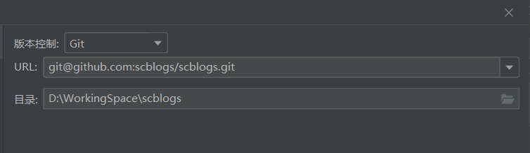

# 论如何参与一个开源项目

# 写在前面的一些话

说起开源项目，好像人人都懂：不过就是一群人一起写了些东西，并且这些东西是公开的，大家都能看。但要细说，可能大多数的开发者都说不出个所以然，甚至不知道怎么提issue。

所以我就想写这样一篇文章，来聊聊我是如何参与开源项目的，参与开源项目的正确流程是怎样的，以及我们参与开源项目的意义。

本篇文章适合怎样的读者：

- 有一定GitHub和Git基础，会commit pull push、会解决合并冲突、知道仓库和分支的概念；
- 有自我提升的意愿。

---

# 第零步：为何参与开源项目

> 本来是只写了从第一步到第五步的，大纲我都拟好了，分别是*****🤣。后来想了想，既然都写了，为何不写全一些呢？于是便有了这第零步。

作为一名程序员，我想大多数朋友应该都和我一样，在编程方面主要还是靠自学，比如看书、看视频或看博文。

但当我们学习到一定程度的时候，总该把自己所学的东西融会贯通一下。这时候我们就会去试着写一些代码，做一做项目。

而聪明的开发人员会意识到那些有长期积累经验的开源项目当中蕴含着大量的知识，可以从优秀开源项目的代码当中学习到相当多的东西。

如果恰好有兴趣且恰好有时间，参与开源项目将会是提升自我的好机会，你的代码将会经过一双双眼睛的审查，你将得到其他程序员的建议，这在无形之中便能提升你的代码质量和规范。

尤其是作为学生，在校能接触到的项目一般都是比较简单的，类似图书管理系统、学生选课系统之类的（可能自己觉得不简单🤣），但在开源社区，你可以接触到各种方向的开源项目，甚至企业级的大型项目。

总之，可以确信的是，参与到一个合适的开源项目中，一定是对你有较大帮助的。

> 欢迎大家参与我的开源项目校园博客 [https://github.com/stick-i/scblogs](https://github.com/stick-i/scblogs)，这是一个基于SpringCloud + Vue2的微服务项目，后端主要由我负责，原来的前端开发者忙着考公去了（果然人生的尽头还是编制），所以现在非常期待各位朋友的加入🧐。

# 第一步：提出问题

我们在写代码之前，总得想想自己要写些什么东西，总不能上去就是一句 "Hello world" 吧！==那我们要参与一个开源项目，是不是也得想想自己该为这个项目贡献一些什么功能？==

这时候，我们需要先了解这个项目。就拿[我的校园博客](https://github.com/stick-i/scblogs)来说，我们可以先去[项目官网](http://scblogs.cn/)进行使用体验，找到一些bug或者还没有完善地方，再或者找到一些可以新添加的功能，那么这些就是我们要提出的问题了。

1. 于是乎，我们去==给项目提一个issue，并根据社区的提问要求，将自己的想法用issue来告诉项目负责人==。

2. 写好标题和内容后，点击右下角`Submit new issue`，你就能看到自己创建的一个issue了，那么恭喜你，已经为这个社区贡献出了自己的一份力量，尽管这只是一个issue！

3. ==提出问题，其实也可以是寻找问题。==有些时候，我们可能无法轻易的找到项目的bug，也没有什么好的建议，这时候，我们也可以直接去查看社区里已经存在的issue。

   ==下面这些其实都是别人已经提出的问题，可以在里面找一个我们想做的并且还没有被分配的==，一般建议新人贡献者找那种带有 `good first issue` 标签的问题，这类问题更适合提供给新同学作为加入开源项目的第一个贡献，因为它们相对较简单。

4. 那不管怎么样，我们现在至少创建或者找到了一个合适的issue。==现在，我们去这条issue的评论区发送一句话，表示自己想认领并解决这个问题==，就像这样：

   

5. 接下来，我们只需要等待社区的管理员回复你。如果他同意了你的issue并且觉得你可以解决这个问题，他会回复你的评论，并且将这个问题分配给你，就像这样：

# 第二步：Fork仓库

是时候开始进行项目的开发了！可是我们应该把代码写在哪里呢？

直接把代码下载下来，然后在本地开始写代码，写完代码再通过社交软件发送给项目的管理人员吗？当然不是，这一点都不Git。

==我们应该先将原仓库Fork到自己的仓库里（在项目首页的右上角），相当于把这个仓库`深拷贝`一份到我们自己的仓库里。因为这样我们才有编辑的权限，写完代码以后才能将代码提交到GitHub上==：

点击 `Create fork` 即可

Fork成功之后，在我们自己的仓库里就会有一份与原仓库一样的仓库，并且这个仓库是我们自己的，这意味着我们可以在这个仓库里进行任意的代码更改，But原仓库我们仍然是没有权限的。

==所以我们将来编写代码的时候，就是在这个仓库上进行操作的。==

现在我们将代码拉取到本地，我比较喜欢使用idea进行git操作，这个url记得用自己仓库的url：

## 保证分支仓库和主仓库同步

仓库Fork以后，会出现一个新的问题：原仓库会有人更新代码，但我们的仓库不会被自动更新，就会导致两个仓库的进度不一致，将来提交PR的时候就可能会造成合并冲突。==所以我们每次写代码和提交代码之前，最好都要先去同步一下我们的仓库。==

## （1）在GitHub上进行同步

点击分支仓库的Sync fork按钮，可以对分支进行更新操作：

## （2）在idea上进行同步

有时候我们使用方法一解决冲突可能会比较麻烦，因为在网页上操作没有那么方便，所以我更建议大家使用这个方法二。

1. 首先在本地git仓库中添加多个远程仓库，右键点击远程，然后会弹出一个管理远程，点进去就可以配置远程仓库了

   

   这是我配置好的远程仓库，第一个main是源项目的仓库，第二个mine是我自己的（我用来演示的账号名就叫scblogs），我给他们分别取了对应含义的名称：

   

   然后我们点左边的fetch刷新一下，就可以看到有两个远程了：

   

2. 当我们要准备写代码和提交代码之前，先fetch一下远程仓库，看看网络图，主仓库里有没有更新些什么东西

   

   我们发现远程的主仓库的main分支已经超过了当前我的分支（那个黄色的标记就是本地的当前分支），两个仓库不一致的时候（看不清可以放大），那我们就要及时的去拉取主仓库main分支的代码，将自己的仓库进行更新。

3. 拉取代码的时候选择主仓库的main分支，然后点拉取，就会更新合并到本地分支代码了：

   

   更新之后，我们当前分支已经处于最新的版本了：

   

# 第三步：编写代码

~~没什么好说的，写代码就好了。~~

- ==在我们写代码之前，最好先看看项目的贡献者说明，或许我们在参与某项目之前就应该先看这个。==一般是主目录下的一个叫做 **CONTRIBUTING.md** 的文件，里面会写一些注意事项，包括代码规范和编写代码的一些操作、流程、步骤等，仔细阅读这份文档，可以保障我们的更好的参与项目的贡献。

  

- ==写的过程中如果遇到了疑问，及时向社区提问，以免自己白费一通力气。==一个有活力的社区，一定会有人及时回复你的。不过也要注意提问的内容，有些东西能在搜索引擎上获得答案的，就不要去打扰别人了。

- ==对了，在你提交代码的时候，最好把每次提交的内容都尽可能的进行细分。==比如，我现在正实现用户排行榜的功能，而用户排行榜又分为了用户活跃排行榜和用户等级排行榜，那么我应该将它们分成两次提交，且每次提交都只添加跟当前提交描述相关的代码。又或者，我在实现排行榜功能的过程中，发现了一个之前遗留的bug，那么我应该将解决这个bug的代码进行单独的一次提交。

  ==这样将提交细分的好处就是，将来管理员要对你的代码进行审查的时候，他将会更清楚的知道你每行代码的目的，也会更方便于历史提交信息的查询。==

- 然后就是写代码，写完了，commit 提交，然后 push 到自己的仓库上去，如果这时候发现主仓库的main分支有更新的代码，最好也手动同步一下，并将冲突解决。

- 温馨提示：==在提交代码之前，最好先自己对自己的代码进行一次审查==，在idea的提交界面，可以很方便的对自己修改过的代码进行审查。审查的过程中注意判断，只提交那些有意义的代码，有些调试过程中留下的代码，是不应该被提交的：

  

此时我已提交并推送完毕：

# 第四步：创建PR

到这一步，我们已经准备好将自己写的代码提交到主仓库了，但由于我们没有主仓库的操作权限，所以是无法直接提交到主仓库的。

这时，我们需要创建一个 `Pull Request` （俗称PR），意思是请求主仓库的所有者从你的仓库中拉取代码合并到主仓库中。

## 如何写描述信息

还记得我们之前创建或者认领的那个issue吗，如果我们此时要提交的代码已经解决了这个issue所涉及的问题，那我们就可以在PR当中把这个issue关闭了，只需要在我们等会要填写的**描述信息**里加上 "close #78" 就可以了，78指的是那个issue的编号，可以在它的页面上看到：

==当然，PR的描述信息里不能只有个 close，否则会让项目负责人很抓狂，因为他无法确定你写的代码是否能够达到预期的效果，甚至他可能还得去自己进行一次测试。==

==所以正常的描述信息，应该包含这个PR解决了什么问题、如何解决的、以及新增代码的测试效果截图==。测试截图很重要，我们截图之后是可以直接粘贴到github的描述信息里的，非常方便，但这几张图片却可以让负责人对你的代码更放心。

---

关于如何发起PR，我们可以在GitHub的页面上进行操作，也可以在idea上进行操作，我个人更喜欢在idea上操作。下面我将分别介绍这两种方式。

## （1）在GitHub上发起PR

1. 进入到我们的仓库主页，可以看到上面提示说我们的分支领先于主仓库的main分支：

2. 点击Contribute，然后点击Open pull request：

3. 此时系统会自动帮我们跳转到创建PR的页面，填写完提交信息，指定从哪里合并到哪里（一般是选择从我们自己仓库的main分支合并到主仓库的dev分支），点击`Create pull request`即可：

## （2）在idea上发起PR

PS：这是由GitHub插件提供的功能，只支持GitHub的PR管理。

1. 找到并打开  视图 -> 工具窗口 -> 拉取请求：

2. 这里选择主仓库，因为我们是要对主仓库发起PR，然后点击查看拉取请求：

   

3. 点击设置旁边的加号，开启一个新的PR：

   

4. 指定从自己仓库的main分支合并到主仓库的dev分支，填写标题和描述，点击创建拉取请求即可：

   

# 第五步：代码审查

==当项目管理员收到你提交的PR后，他会对你提交的代码进行审查。==说白了就是查看你写的代码，并考虑其中写的好的和写的不好的地方，然后给你提出意见和建议。

作为贡献者，我们需要根据管理员的意见进行代码的修改，或者~~（跟他掰扯掰扯）~~跟管理员解释我们为什么要这样写，这样写的目的是什么，总之，你们两协商并达成一致就可以了。

那当我们修改完代码后，再提交到自己的仓库中 **之前用来创建PR的那个分支**，之前创建的PR就会被自动更新了，不需要我们再开启一个PR（除非之前的PR被关闭了）。

那如果我们的代码通过了审查，它就会被合并到主仓库中，这时候我们的一次代码贡献就算是完成啦！你会被列在项目的贡献者列表中，就像这样：

# 写在文末的一些话

看完这套流程，可能很多朋友会想，参加开源项目咋这么麻烦，那我还是不参加了🤣🤣。

我写这篇文章的时候也觉得麻烦，咋这么难写，写了我好几天，可能是因为我~~太菜~~写的太详细了哈哈哈哈哈哈哈😅。

但平时我参与项目贡献的时候，其实并没有觉得有什么麻烦的地方，也就是点几下点几下，很快就搞定了，时间主要都花费在了提问、沟通和写代码上，并没有在这些“杂七杂八”的流程上浪费什么时间。而且这套流程中有几步其实是只要做一次的，真正需要每次都操作的，其实只有写代码、创建PR和同步仓库。

怎么说呢，自己尝试一下，把这套流程操作一遍，或者去参加一个开源项目（欢迎来[校园博客](https://github.com/stick-i/scblogs)🥰），自己从头到尾操作一遍之后，就没什么问题了，以后再想去参加各种开源项目，至少流程都懂了。

对了，如果你看了这篇文章之后还想了解得更多，可以再看看这位作者的文章，我觉得写得挺好的，分享给大家：https://mp.weixin.qq.com/s/mY-1mDFvBkyHGBgI9KpGOA

如果这篇文章对你有帮助，那就赶快去找个合适的开源项目试一试吧！从实践中去练习这些步骤，会让你对它的理解更加深刻噢！
